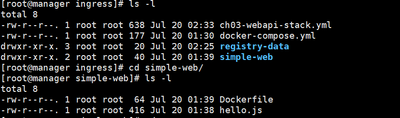
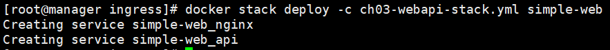

# Docker(0720)

---

### 4일차에 이어서

swarm이 구성된 상황에서 아무 프로세스 하나 강제로 종료해보겠음

```sh
# 컨테이어 ID가 e7로 시작하는 놈 죽이겠음
$ docker stop e7 && docker rm e7
$ docker service ps my-nginx # 지워진 프로세스가 어딘가에 다시 실행된 것을 확인할 수 있다
```

---

## STACK

하나 이상의 서비스를 그룹으로 묶은 단위

briget network : 하나의 호스트에서만 작동하는 네트워크

overlay network : 여러 호스트 사이에서 작동하는 네트워크, 스택을 사용해 배포된 서비스 그룹이 여기에 속함

<br/>

### overlay network 생성

```sh
$ docker network create --driver=overlay --attachable ch03 # ch03이라는 overlay network 생성
```

기존에 있던 registry 삭제하고 yml 실행

```sh
$ docker service rm my-nginx # 레지스트리 삭제(이름이 중복됨)
$ mkdir ingress
$ cd ingress
$ mkdir simple-web
```

만든 simple-web에서 다음 파일 생성

```sh
$ vi Dockerfile #아래 내용

FROM node:slim

EXPOSE 8000

COPY hello.js .

CMD node hello.js


$ vi hello.js # 아래 내용

var http = require('http');
var os = require("os");
var hostname = os.hostname();

var content = function(req, resp) {
 var ip = req.headers['x-forwarded-for'] ||
     req.connection.remoteAddress ||
     req.socket.remoteAddress ||
     req.connection.socket.remoteAddress;

 resp.end("Hello Docker and Swarm - " + ip + ", " + hostname); 
 resp.writeHead(200);
}
var w = http.createServer(content);
w.listen(8000);
```

ingress로 와서 파일 생성

```sh
$ docker-compose.yml

version: "3"
services:
  registry:
    container_name: registry
    image: registry:latest
    ports:
      - 5000:5000
    volumes:
      - "./registry-data:/var/lib/registry"


$ vi ch03-webapi-stack.yml

version: "3"
services:
    nginx:
        image: gihyodocker/nginx-proxy
        deploy:
            replicas: 3 # 레플리카 수
            placement: 
                constraints: [node.role != manager] # 매니저가 아닌곳에 설치하겠다
        environment: 
            BACKEND_HOST: simple-web_api:8000 # 앞에 있는게 우리가 만들 서비스 이름, simple-web은 스택이름 api는 서비스이름이다. 뒤엔 실행될 포트번호
        depends_on:
            - api   # api가 실행되어야 nginx를 실행하겠다는 의미
        networks:
            - ch03
        ports:
            - 80:80
    api:
        image: manager:5000/example/simple-web:latest   # api라는 서비스는 이 이미지를 갖고 만들어짐            
        deploy:
            replicas: 3
            placement:
                constraints: [node.role != manager]
        networks:
            - ch03
networks:
    ch03:
        external: true
```

현재 갖고있는 파일 및 폴더



이미지 생성, 레지스트리 등록

```sh
$ docker build -t simple-web:latest . # 도커파일 기반 이미지 생성
$ docker tag simple-web manager:5000/example/simple-web # example/simple-web기반localhost:5000/example/simple-web
$ docker push manager:5000/example/simple-web # 레지스트리에 등록
```

스택 생성

```sh
$ docker stack deploy -c ch03-webapi-stack.yml simple-web
```

스택이름(simple-web) + 이름(nginx, api)으로 서비스가 만들어지는 것을 확인할 수 있다



```sh
$ docker stack ls # 서비스 목록 보기
$ docker stack services simple-web # 그 목록 중 이름으로 안에 있는 서비스 확인
$ docker stack ps simple-web # 이름으로 상세확인
```

