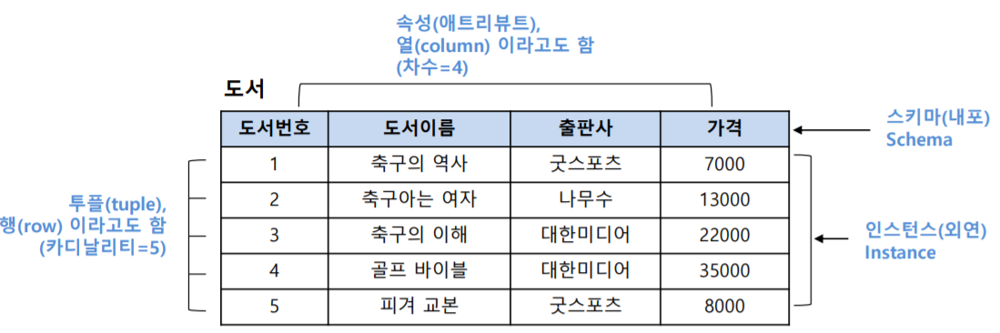
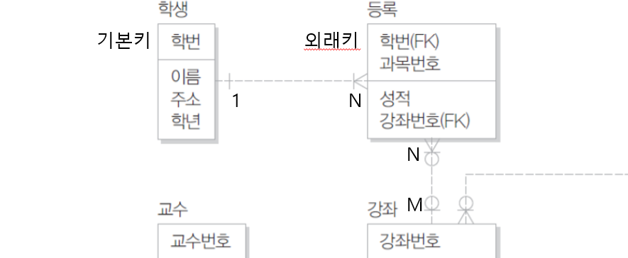
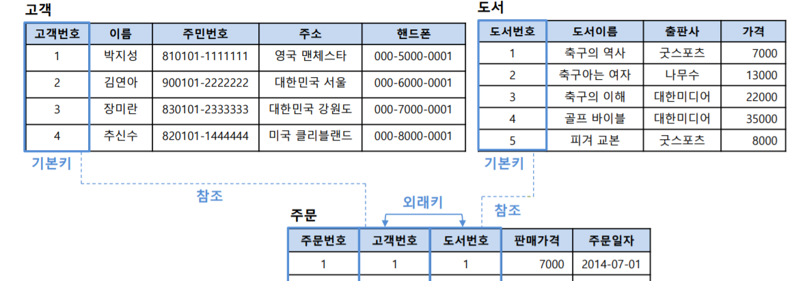
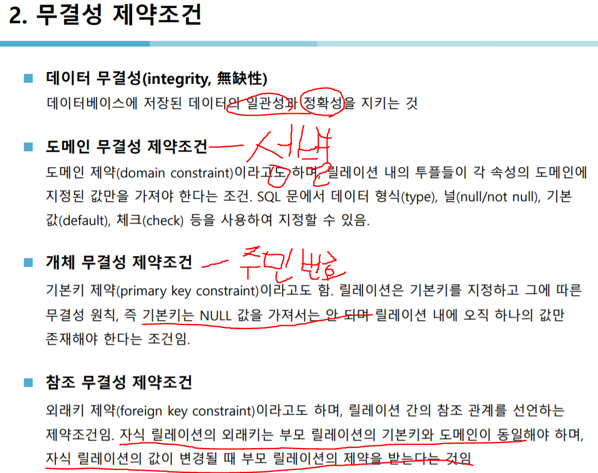
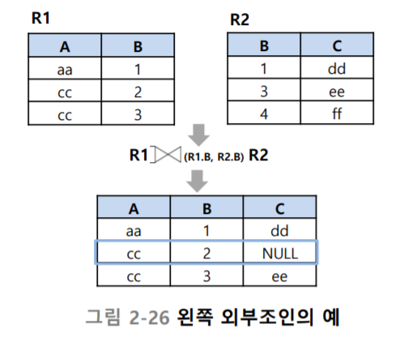

# Ddatabase(0722)

DDL - 정의어(data definition language) : create , drop, altor

DML - 조작어(data manipuldateion language) : insert, select, update, delete

DCL - 제어어(data control language) : grant revoke

<br/>

도메인 : 도메인은 동일한 테이블 타입을 가지는 속성을 분리하는 것을 의미

속성 = column = field

record = row = tuple = cadinallity



<br/>

select 간단예시

```sql
select 컬럼 from 테이블 where 조건
```

---

M:N관계는 보통 만들지 않고 둘을 쪼개서 1:M , 1:N으로 만든다





---

다시 도커의 mysql로 돌아와서, 모든 영역(node, window 등)에서 접근 가능하게 만들어주고 싶다

master에서 작업해주자(난 node3)

```sh
$ yum install mysql # 만약 설치 안된다면 아래 구문 실행하고 다시 실행
$ yum install epel-release

$ mysql -h192.168.56.12 -ugihyo -p # 접속 안 될 것임
$ netstat -ntl # 공개된 포트중에서 mysql포트가 없는 것 확인

# manager로 와서
$ vi todo-mysql.yml # 에서 마스터와 슬레이브 모두에 아래줄 추가
ports:
  - 3306:3306
  
#스택과 서비스 지웠다가 다시 deploy. 그럼 또 포트 충돌 나는데, todo-mysql.yml의 슬레이브 모두 주석처리 해버리자

# 다시 node3으로 돌아와서 접속
$ mysql -h192.168.56.12 -ugihyo -p

# 이거에 맞게 workbench에서 설정해주면 접속된다
```

이제 work\db\script 에 있는 madang 과 hr 을 복사해서 workbench 에서 실행해주자

여기서 권한 오류가 뜨는데 gihyo 대신 root 로 접속해서 db를 만들어준다

# 시험문제 pdf2 28page




외부조인(p.56) : 주문하지 않은 장미란 데이터도 가져올 수 있다



현재 왼쪽 다 표시(left join)