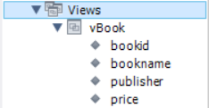
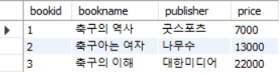
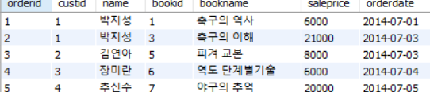

# Ddatabase(0724)

## 내장함수

자세한 함수내용은 pdf 4 참고

<br/>

고객별 평균 주문금액을 백원단위로 반올림한 값 구하기

```mysql
select custid '고객번호', round(sum(saleprice)/count(*), -2) '평균금액'
from Orders
group by custid;
```

고객 성으로 구분하기

```mysql
# 성과 이름 분리
select substr(name, 1, 1) '성', substr(name, 2, 2) '이름' from Customer group by name;

# 성끼리 그룹
select substr(name, 1, 1) '성', count(*) '인원' from Customer 
group by substr(name, 1, 1); # 1번째 자리에서 1개 가져옴
```

​	날짜함수 adddate

```mysql
select orderid, orderdate, adddate(orderdate, interval 10 day) from Orders; # 10일 후
select orderid, orderdate, adddate(orderdate, interval -1 month) from Orders; # 1달 전
```

date_format, str_to_date

```mysql
select orderid, str_to_date(orderdate, '%y %M %d') from Orders # 문자열 to 날자형
where orderdate=date_format('20140707', '%Y%m%d'); # 날자형 to 문자열
```

---

## NULL

IFNULL

```mysql
select name ,ifnull(phone, '연락처ㄴㄴ') from Customer; # null이면 연락처ㄴㄴ로 변경
```

---

### 서브쿼리

스칼라 서브쿼리 : select문에 서브쿼리 작성

```mysql
# join으로 구현
select Orders.custid, name, sum(saleprice)
from Orders, Customer
where Orders.custid=Customer.custid
group by Orders.custid;

# 서브쿼리로 구현
select custid, 
	(select name from Customer c  where c.custid=o.custid),  # 서브쿼리는 반드시 하나의 속성만 반환해야한다 안그러면 오류 뜸
	sum(saleprice)
from Orders o
group by  custid;
```

인라인 뷰 : from 안에 서브쿼리 작성

인라인 뷰를 사용하여 고객번호가 2 이하인 고객의 판매액 구하기

```mysql
select name, sum(saleprice) from 
	(select custid, name from Customer where custid <=2) c, Orders o
where c.custid=o.custid
group by name;
```

---

## 뷰

하나 이상의 테이블을 합하여 만든 가상의 테이블

Book 테이블에서 ‘축구’라는 문구가 포함된 자료만 보여주는 뷰 생성하기

```mysql
create view vBook
as
select * from Book where bookname like '축구%';
```



```mysql
select * from vBook;
```



<br/>

Orders 테이블에 고객이름과 도서이름을 바로 확인할 수 있는 뷰를 생성한 후, ‘김 연아’ 고객이 구입한 도서의 주문번호, 도서이름, 주문액을 보이시오.

```mysql
create view vw_Orders(orderid, custid, name, bookid, bookname, saleprice, orderdate)
as
select o.orderid, o.custid, c.name, o.bookid, b.bookname, o.saleprice, o.orderdate
from Orders o, Customer c, Book b
where o.custid=c.custid and o.bookid=b.bookid;
```



<br/>

### 뷰의 수정

대한민국 국적만 나오는 테이블에서 영국 국적 가진 사람만 나오게 수정

```mysql
create or replace view vCustomer(custid, name, address)
as
select custid, name, address
from Customer
where address like '영국%';
```

고객별 총 구매 금액 리스트 뷰 만들기

```mysql
create view vOrderTotal(name, totalprice)
as
select c.name, sum(saleprice)
from Customer c, Orders o
where c.custid=o.custid
group by c.custid;
```

<br/>

### 뷰 삭제

```mysql
drop view [뷰 이름]; # 뷰 삭제, 원본 테이블은 삭제 안 된다
```

