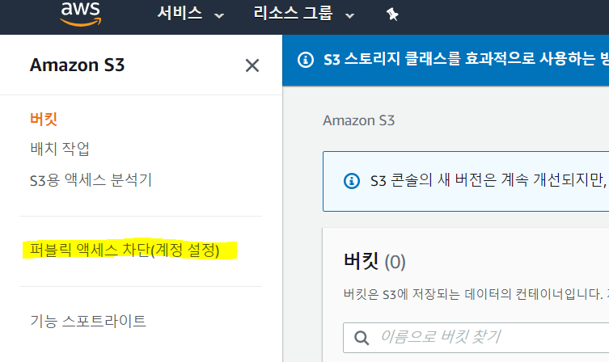
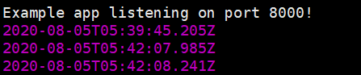
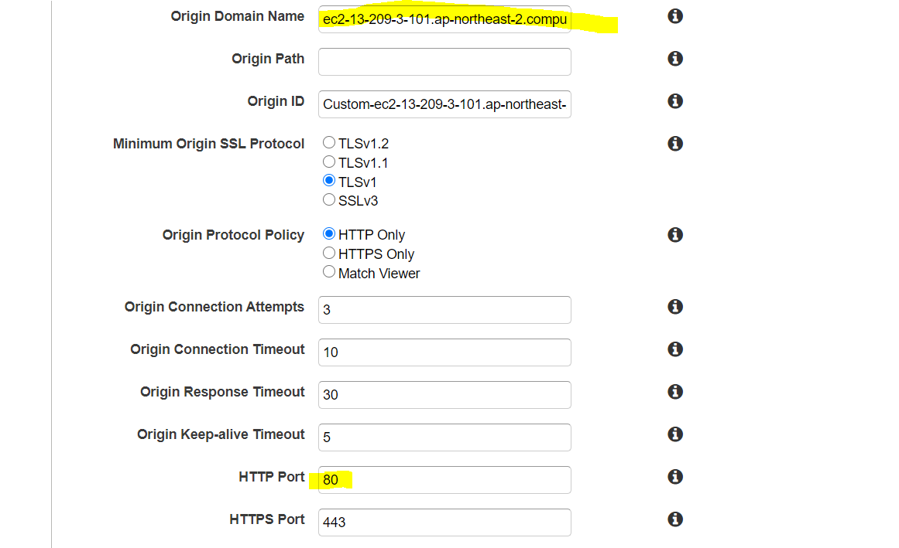
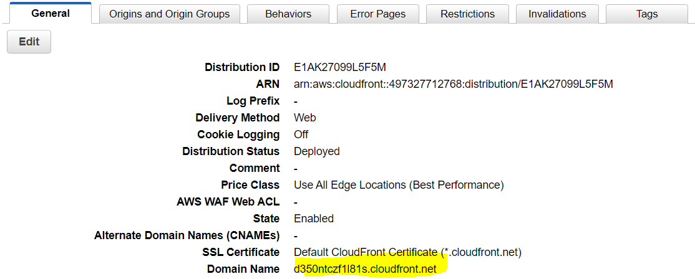
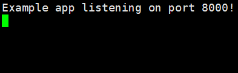
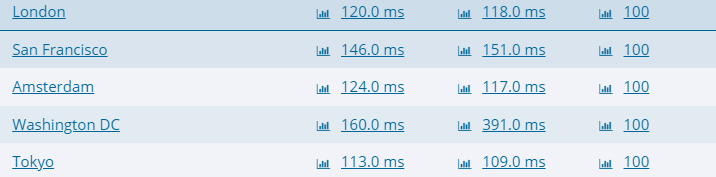
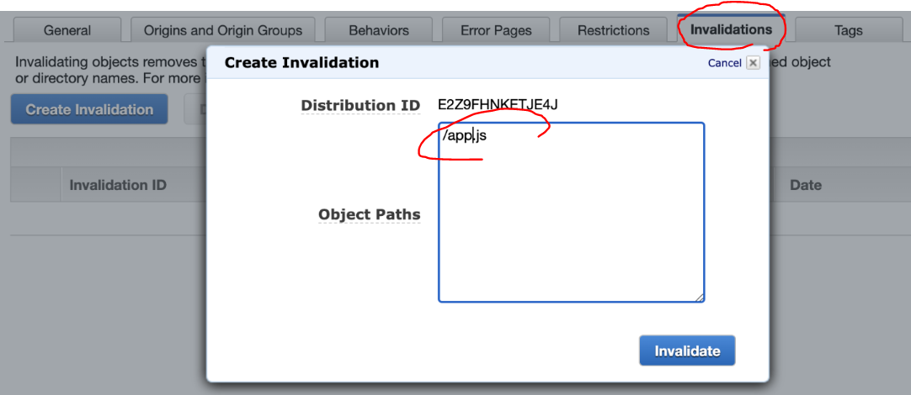

# AWS


## S3

Simple Storage Service

Root 계정 사용 시 계정설정에서 권한 public로 바꿔줘야한다(안그러면 버킷 자체를 public해도 안먹힘).




자세한 설명은 생략.

---


## CloudFront

CDN : 컨텐츠 전송 네트워크(contents delibery network)

CLoudFront : 아마존에서 제공하는 CDN 서비스, 캐시를 제공하여 페이지 불러오는데에 시간 단축

<br/>

ec2에서 client로 바로 요청하면 느렸지만, ec2와 client 사이에 cloudFront 추가하면 캐시에 웹 페이지가 저장되어 사용가능

다만 여기서 단점은 동적인 데이터는  캐시에 저장해놓아도 정적인 데이터를 보여주기 때문에 의미가 없다. 정적인 데이터에 사용하기 좋음

<br/>

아래와 같이 간단히 EC2 안에 app.js 작성 

```js
const express = require('express');
const app = express();
const port = process.env.PORT || 8000;

app.get('/', (req, res) => {
  setTimeout(function() {
    res.send("sleep all day : " + new Date());
    return console.log(new Date());
  }, 3000);
  //res.send('sleep all day : ' + new Date())
});
app.listen(port, () => console.log(`Example app listening on port ${port}!`));
```

{aws주소}:8000 접속


다음과 같이 로그 확인 가능하다



이제 캐시서버 만들어서 테스트 해 볼 차례

<br/>

먼저 cloudFront에 가서

아래만 수정해서 create



<br/>

domain name으로 cloudFront 캐시서버에 접속



<br/>

새로고침해도 시간이 안바뀌는 것을 확인할 수 있다. 페이지 소스 보면 캐시로 저장되어있음


<br/>

새로고침해도 서버에 로그가 안생긴다.



코드에 3초 딜레이가 있어도 바로 실행됨을 알 수 있다




캐시를 삭제하고 싶으면 다음과 같이

