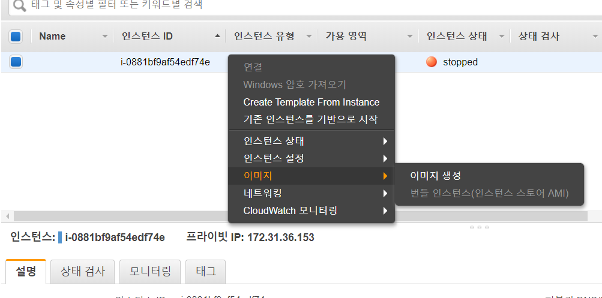
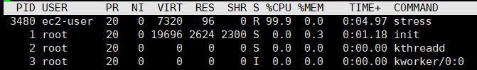
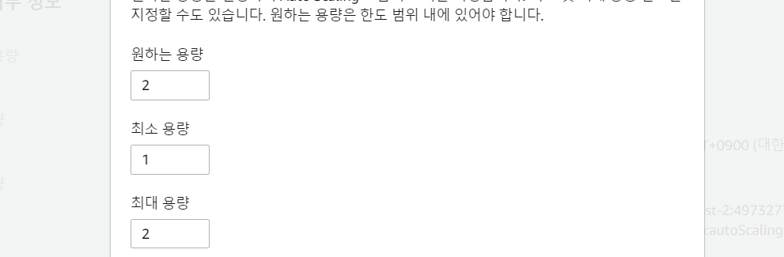
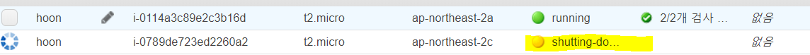

# AWS 2008006


## RDS


ec2와 rds가 연결 조건

1. vpc가 같은 private network
2. sg에 ec2 등록
3. ec2에 mysql client 설치

ELB(elastic load balancer) : 여러개의 인스턴스(EC2)에 연

---

## AutoScaling

인스턴스 정지하고 이미지 생성



이미지 > AMI 들어가면 availible 되어있는 것 확인가능

### 템플릿 생성

인스턴스 > 시작템플릿 생성

이름 정하고 AMI 선택

인스턴스 유형 : t2.micro(프리티어전용)

키페어 선택

보안그룹 선택

### AutoScaling 생성

AutoScaling > AutoScaling Groups 새로 만들기

1단계 : AS이름과 템플릿 선택

2단계 : VPC와 서브넷(3개)선택

4단계 : 최대용량 - 2 , 대상 추정 조정 정책 선택

## StressTest

생성된 인스턴스에 cpu 사용을 99%로 주면 자동으로 새로운 인스턴스가 생성된다

```sh
$ sudo yum install stress -y # 설치
$ stress --cpu 1 --timeout 600 # 스트레스 시작
```



새로운 인스턴스가 생성된 것을 확인


<br/>

스트레스 테스트 종료하고 그룹 편집에서 인스턴스 1개로 변경(모두 0으로 바꾸면 인스턴스 다 사라진다)



중지중인 모습



기존 인스턴스 접속이 종료되었고, 새로운 public IP로 접속해야한다

---

1. EC2 삭제( auto scaling group에서)
2. auto scaling group 삭제
3. 인스턴스 > 시작 템플릿 (launch templates)삭제
4. 이미지 > AMI 삭제