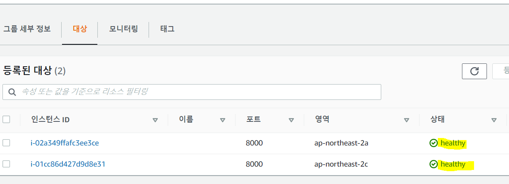
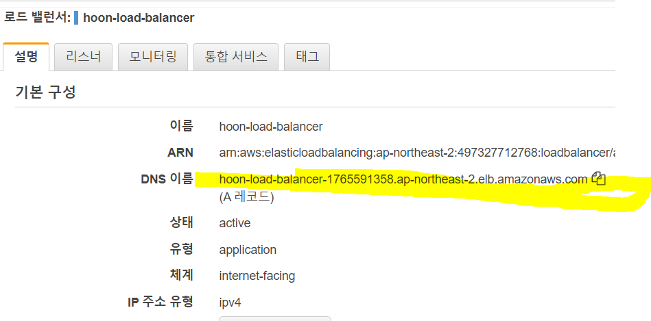
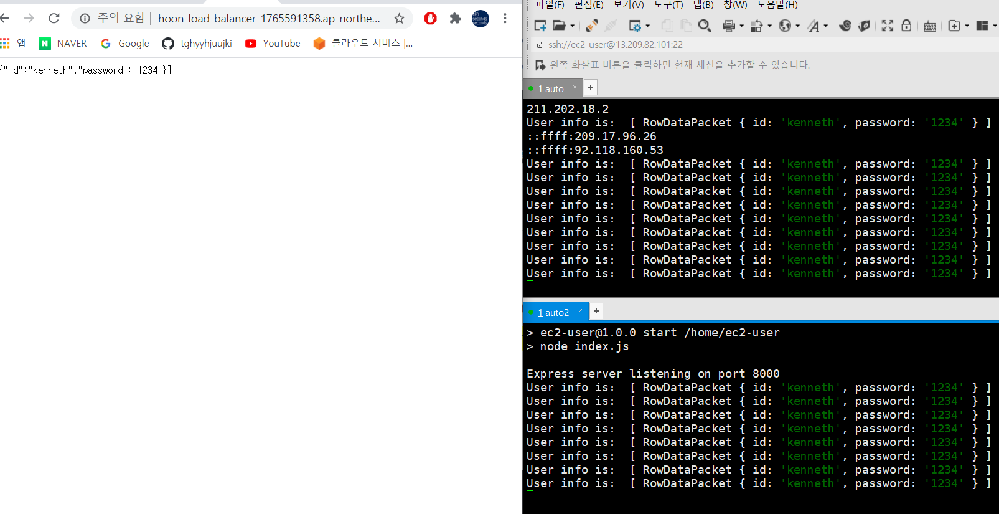
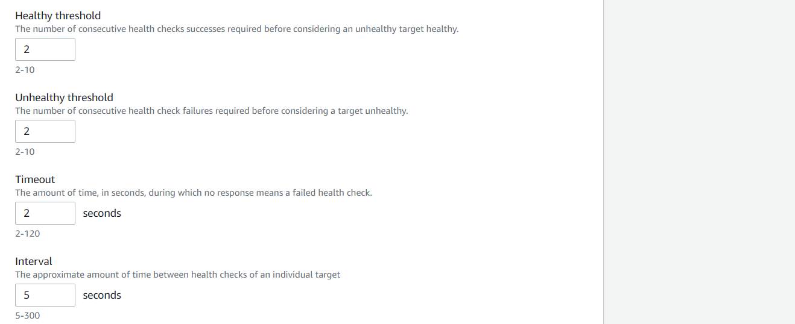
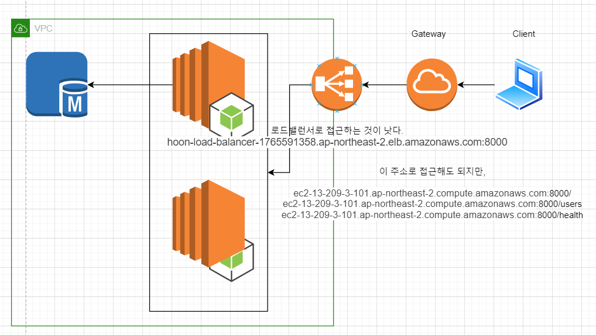

# AWS 2008007

load balancer : 부하분산 해줌

대상그룹(target group): 로드밸런서가 요청을 전달할 서버들을 묶어둔 개념적인 그룹

### 로드밸런서 생성

먼저 오토스케일링 그룹의 현재 인스턴스를 2개로 설정한다. 베이스 AMI 는 이미지 생성 후 정지

로드밸런서 생성페이지 안에서 대상그룹도 생성한다

auto scaling group > 로드밸런싱에서 편집으로 대상그룹을 지정해준다.

대상그룹의 대상에서 health로 변경된 인스턴스 두 개를 확인할 수 있다.

로드밸런서의 DNS이름으로 호출하면 직접 호출할 필요가 없다

default가 round robbin 방식이기 때문에 번갈아가면서 호출되는 것을 확인할 수 있다.

다음과 같이 대상그룹 > 상태 검사 설정 > 편집으로 변경

이 상태에서 두개의 인스턴스중 아무거나 하나를 정지하고 다시 로드밸런서를 호출해보면 처음에는 정지된 인스턴스를 호출해서 bad gate가 뜨다가 살아있는 서버로만 연결해준다. 위 설정은 그러한 반응을 몇초만에 하는지 설정하는 작업

 

현재 상태

---

## 배포

블루/그린 배포 : 무중단 배포 기법중 하나, 블루그룹(원래버전)과 같은 그린그룹을 하나 만든다. 그린그룹에 높은 버전을 설치하고 로드밸런서를 그린그룹에 연결한다. 원래 가동되는 용량의 2배가 필요하다는 특징이 있음

 

blue 라는 이름의 오토스케일링 그룹 생성

기존 이미지 만들고 정지했던 인스턴스 실행

