### web server

1. 인스턴스 생성

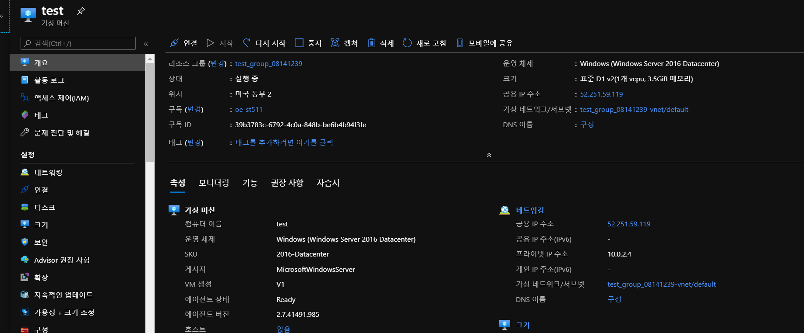

2. RDP 연결

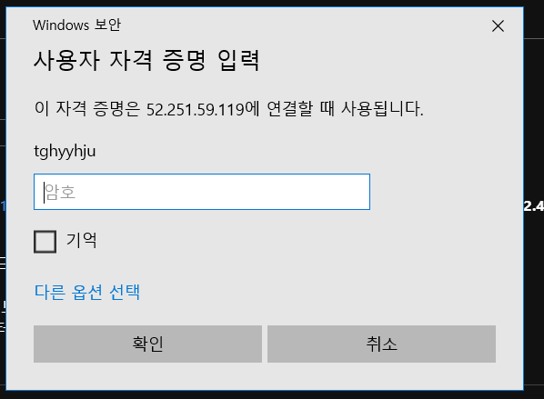

2. IIS 설치

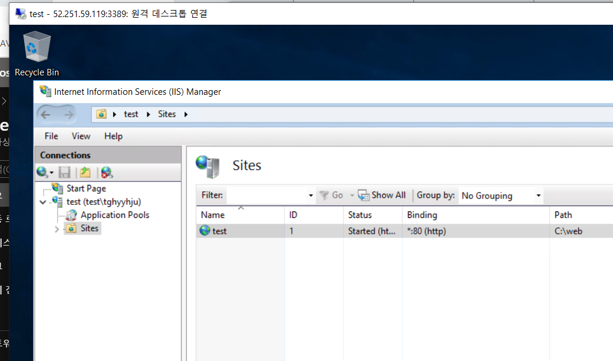

4. html 작성

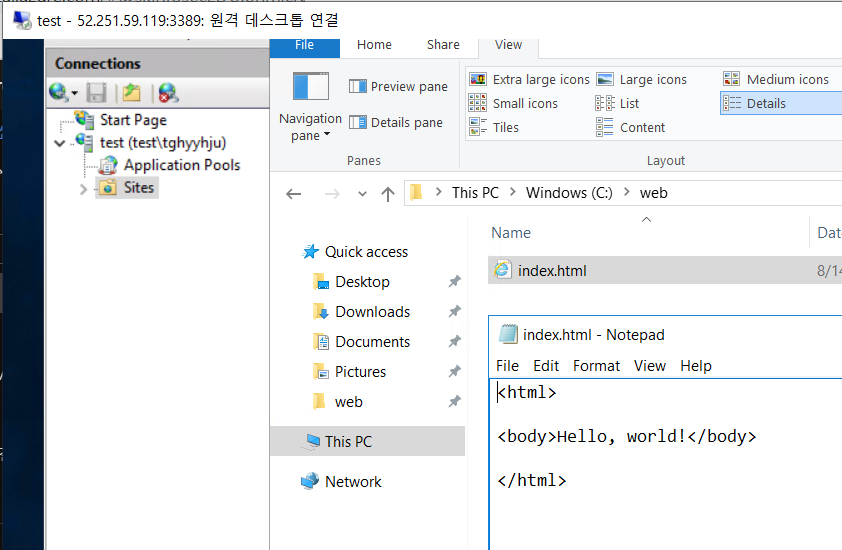

5. 외부에서 접속 확인

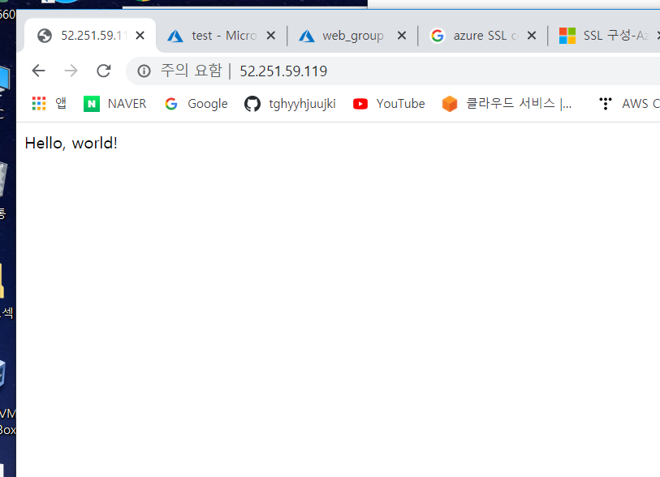

---

### db serever

1. SQL Server VM 생성

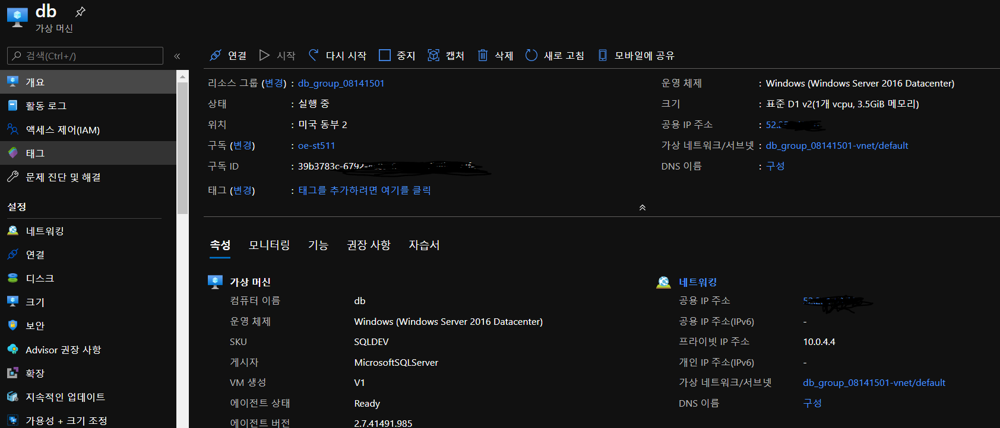

2. SQL Server Management Studio 접속

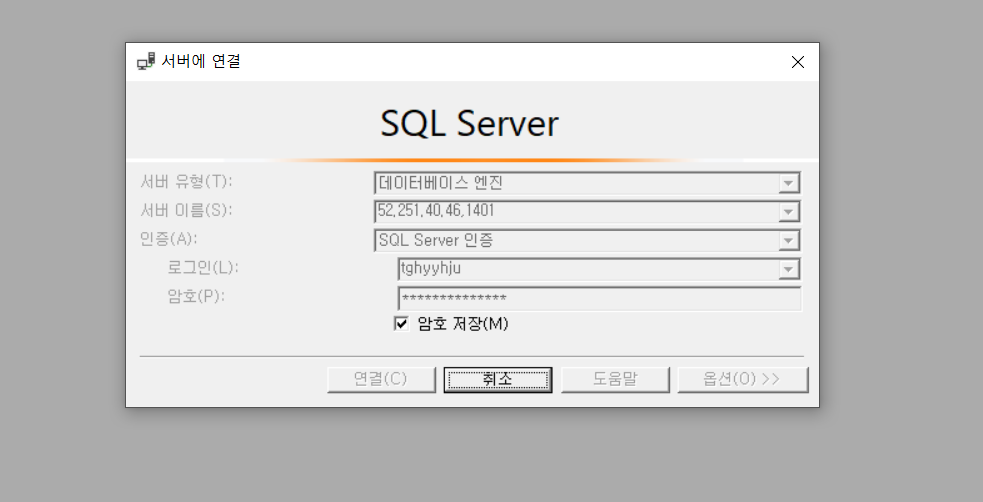

3. db, 테이블 생성

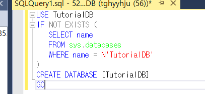

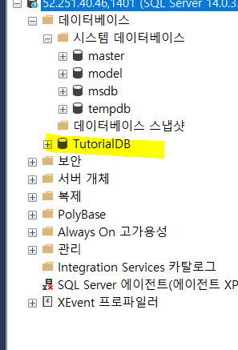

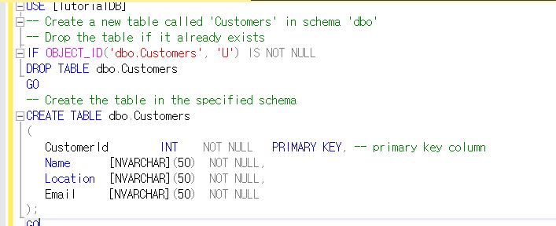

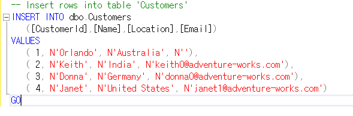

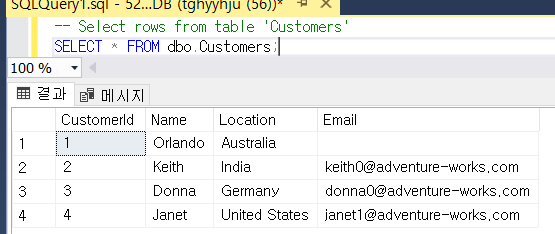

---

### file server

1. 기존 인스턴스에 FTP 설치

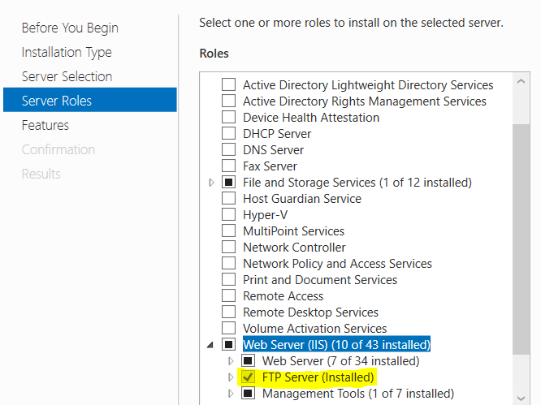

2. FTP 생성 및 방화벽 설정

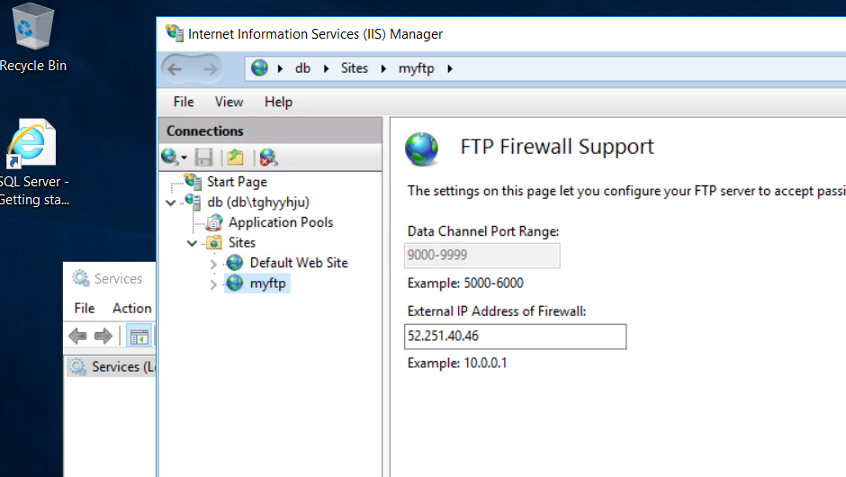

3. 보안 규칙 추가

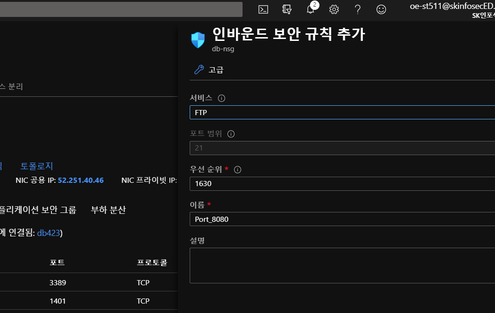

3. 외부에서 연결확인

   인스턴스 안

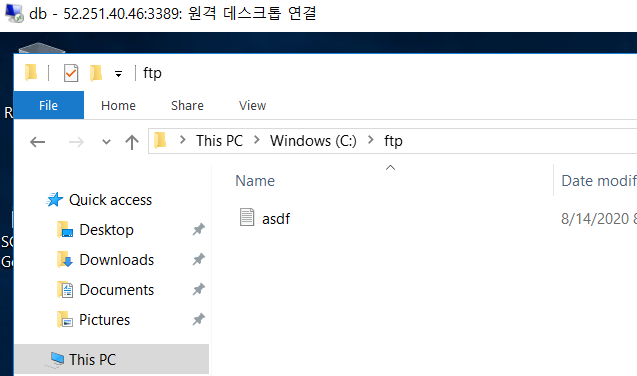

​	외부 컴퓨터

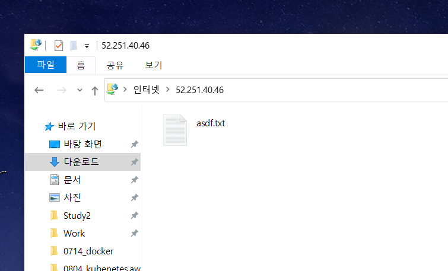

---

### backup server