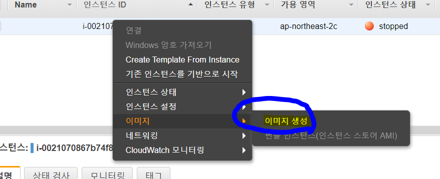
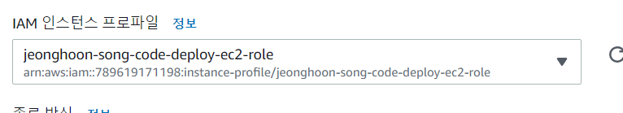
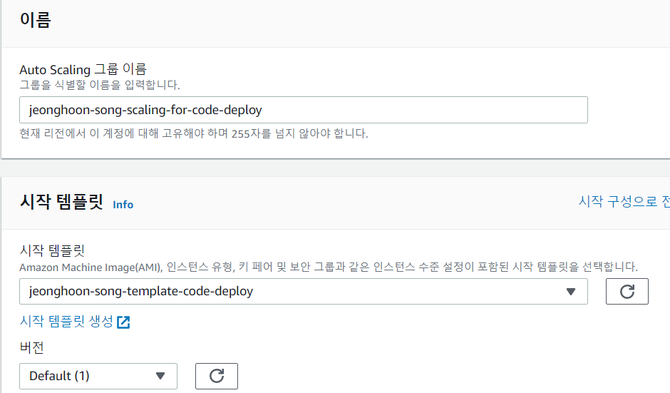
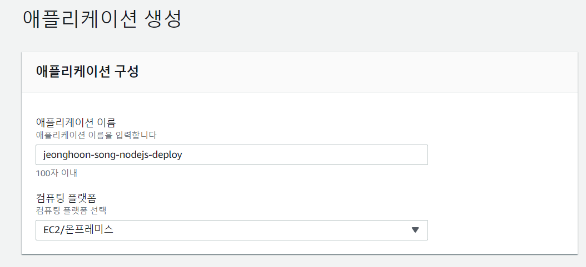
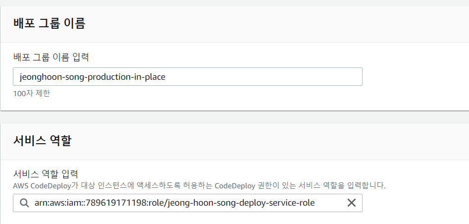
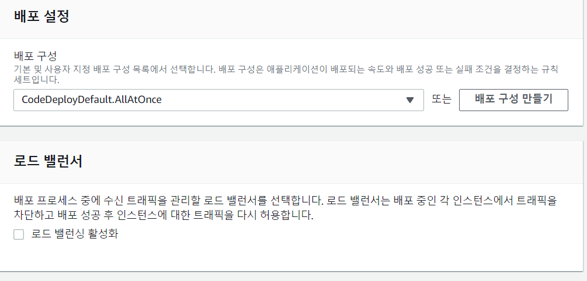
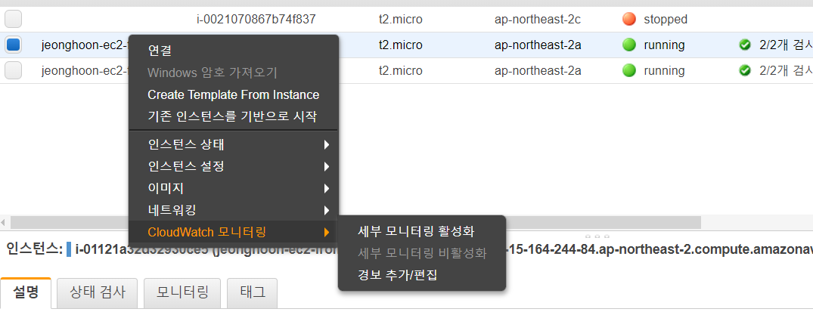

# AWS

### 정책 설정

정책 -> 정책생성 -> 서비스 : s3 -> 작업 : 목록 , 읽기 -> 모든 리소스 -> 생성

### 역할 추가

codedeploy, ec2 역할 생성

---


인스턴스 생성 후 codedeploy 에이전트 설치 및 node 테스트 환경 설정

```sh
$ wget https://aws-codedeploy-ap-northeast-2.s3.amazonaws.com/latest/install
$ chmod +x ./install
$ sudo ./install auto
$ sudo service codedeploy-agent status # 상태확인

# node 설치
$ curl -o- https://raw.githubusercontent.com/nvm-sh/nvm/v0.34.0/install.sh | bash
$ . ~/.nvm/nvm.sh
$ nvm install node
```


이미지 생성 위해 인스턴스 중지 후 이미지 생성



<br/>

### 시작 템플릿 생성

AMI, 인스턴스 유형, 키페어, 보안그룹정책 설정해주고

고급세부정보에서 IAM인스턴스 프로파일에 위에서 만든 ec2-role 추가



### Auto scaling 생성

1단계



2단계 서브넷에서 a,b 선택

4단계 용량은 2, 1, 2로 설정, 조정정책 없음

6단계 태그 Name - 임의의 값 설정

<br/>

이제 새로 생성된 두 개의 인스턴스에 접속해서

```sh
$ aws s3 ls # s3리스트를 확인할 수 있다
```

---

s3 또는 git에 코드 작성하고 배포할 수 있지만, 이번에는 s3에 해보겠음

s3에서 모든 값은 디폴트로 한다. 여기서 접근권한도 디폴트인 접근불가로 설정

실제 업무에서는 git에서 하는게 좋음 왜냐하면 s3는 압축해서 올려야하기 때문에 비효율적이다

다음 파일들을 압축해서 s3에 올린다

```sh
# 윈도에서
git clone https://github.com/joneconsulting/new-simple-nodejs.git
```

이제 codedeploy로 가서 애플리케이션 생성한다



이제 배포 그룹 생성, 생성해놨던 서비스그룹 추가






로드밸런서는 비활성화

<br/>

이제 배포 탭으로 가서 배포 생성

---

### cloud watch



위와 같이 추가할 수도 있지만,

cloud watch로 가서 경보 생성 > ec2 > 내 ec2 id 검색 > cpu utillization 체크

다음으로 넘어가서 임계값만 30보다 크다로 설정하고 다음

새 주제 생성 > 내 이메일 기입하고 다음

이제 만들고 내 메일로 가서 confirm

리눅스 연결해서 스트레스 테스트 설치 및 실행

```sh
$ sudo yum install -y stress # down
$ stress --cpu 1 --timeout 600 # execute
```


로드밸런스, 오토스케일링, 마스터 DB, cloud watch, sns notification, 

이와 별개로 windows 환경에 파이썬 어플리케이션을 로드밸런서와 연결되도록 만들것(DB에 직접 연결 안함)

nodejs로 select, insert 등 구현해서 두개의 인스턴스에 배포

파이썬에서 request 모듈 사용하면 rest aip 호출 가능