# Kali linux

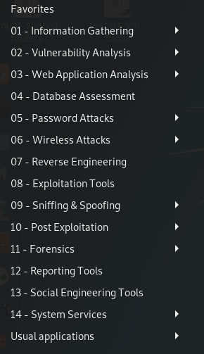

이 도구들은 모의해킹 방법론에 따라 만들어짐

1. Infomation Gathering : 정보 수집
2. 취약성 분석
3. 웹 분석
4. DB 평가
5. 암호해킹
6. 무선해킹
7. 역공학
8. 공격툴
9. 네트워크 해킹
10. 시스템 해킹 후 추가정보 획득
11. 증거
12. 보고서 작성

파이썬 90% 해킹쪽에서 활용함

---

## 1. 정보수집


### kali linux에서 정보수집

```sh
$ locate wordlist # wordlist 라는 문자열을 포함한 모든 파일, 디렉토리 출력

$ fierce -dns google.com --threads 3 # google과 관련된 도메인과 IP 정보 보여줌
```

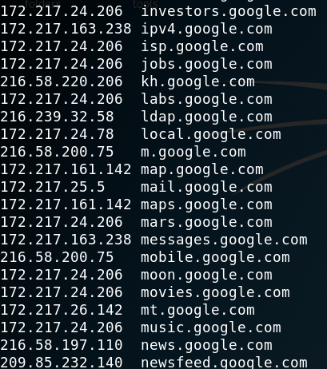

나중에 취약점 점검을 할 때, 아래처럼  IP가 같은데 도메인이 다른 경우가 있다. 미리 정보수집을 해 놓지 않으면, 나머지 도메인의 검사가 누락될 수 있다. 또한 도메인이 같은데 IP가 다른 경우도 있다. 역시 정보를 수집해놓아야한다.

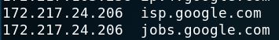


### searchdns 에서 정보수집

다음 주소에서도 정보수집이 가능하다. https://searchdns.netcraft.com/

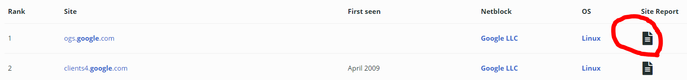

리포트를 살펴보면, 

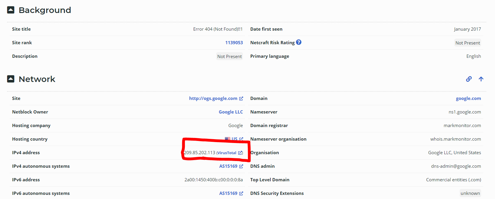

해당 사이트가 악성코드 배포 등의 악의적 행위를 했는지 조회도 가능하다

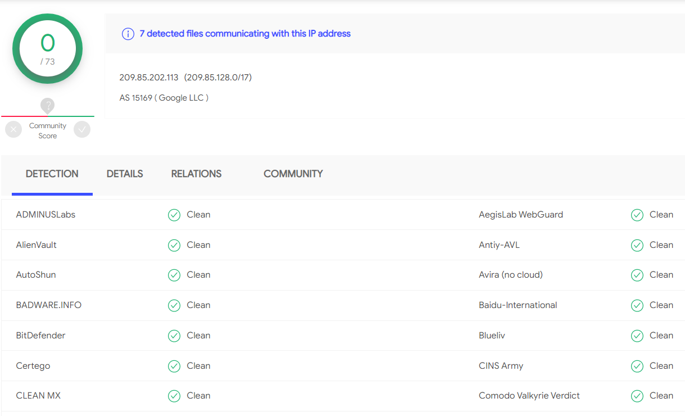

<br/>

### shodan으로 정보수집

서버의 버전정보가 노출되냐 안되냐에 따라서 취약점을 찾아내는데에 중요하게 사용된다.

exploit db에서 nginx를 검색해서 취약점과 공격방법을 찾을 수 있는데, 버전이 노출되면 어떻게 공격해야 하는지 바로 알 수 있다.

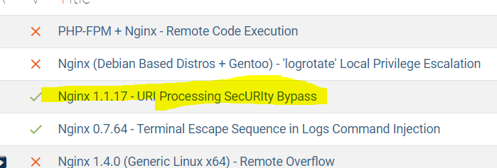


mongodb로 검색하면 수 많은 취약점이 발견되는데, 특히 클라우드에서 올린 것이 많다.	

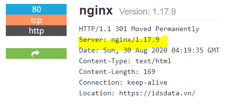

이 사이트 같은 경우 모든 게 노출되어 있다.

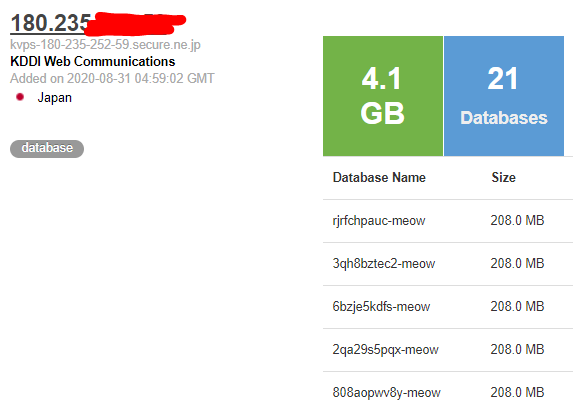

ㅁㄴㅇㄹ

---

## Aws

S3안의 파일검색은 https://buckets.grayhatwarfare.com/

.hwp로 검색해보았다.

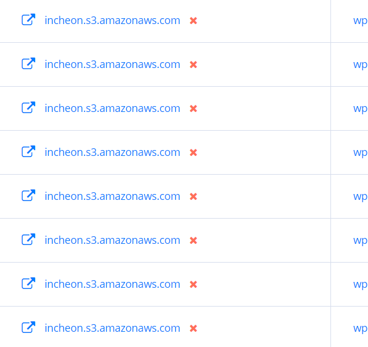

인천 s3가 많이 나온다. 민감한 내용이 있을거 같아서 감히 열어보진 않았다.

---


AWSBucketDump

S3 전용 file탐색기라 보면 된다.

https://github.com/jordanpotti/AWSBucketDump 여기서 클론해서 사용 가능하며,

사용법은 아래와 같다

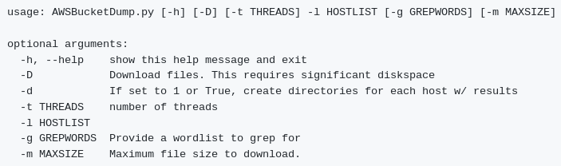

검색할 단어를 interesting_Keywords.txt에 넣고 

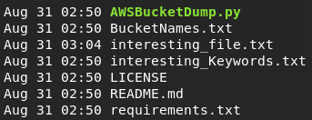

아래의 명령어를 돌리면,

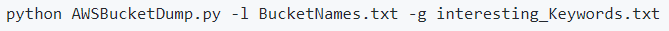

interesting_file.txt에 해당 파일의 url이 작성된다.

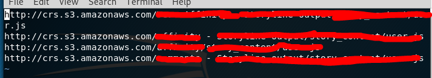

---

## Shodan Python API

아래와 같은 목적을 위해 사용한다.

1. 멀웨어/바이러스 검색 및 치료
2. 웹 사이트 명성 진단
3. 공격 영역 탐색
4. 버그 및 포상 현상금 프로그램

```sh
$ shodan host [ip adress]
$ shodan host --history [ip adress]
```

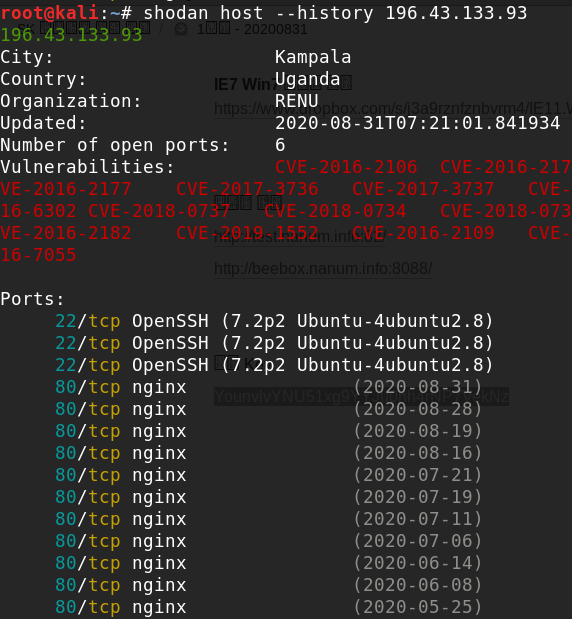

search 명령어로 원하는 단어 선택해서 검색 가능

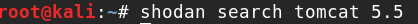

search 명령어로 원하는 단어 선택해서 검색 가능

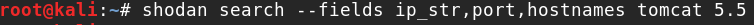


허니팟 : 비정상적인 접근을 탐지하기 위해 의도적으로 설치해 둔 시스템을 말한다. 즉 함정이다.

한국에서 가장 많이 사용하는 포트

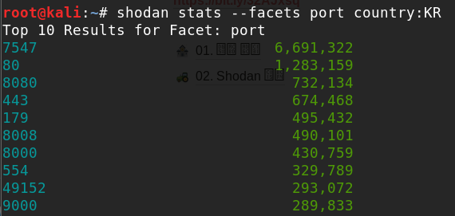

뭐냐 이건

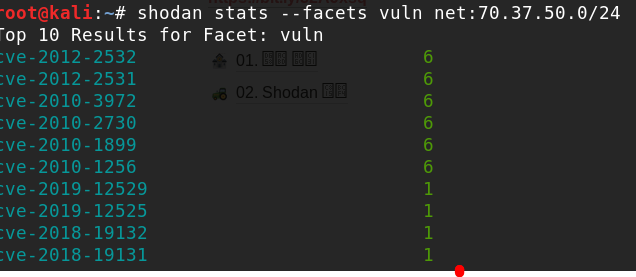


CVE : 공통 취약성 및 노출로, 특정 프레임워크나 시스템의 공개적으로 알려진 정보 보안 취약성 및 노출에 대한 참조방법을 제공함

파싱

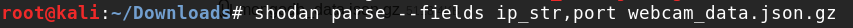

