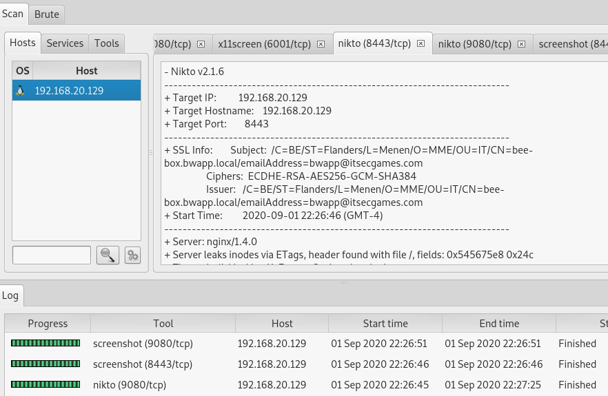
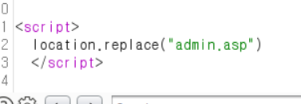
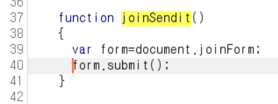

gm.zip을 가상머신에 옮기는 방법

 https://www.rejetto.com/hfs/?f=dl 다운로드 받고 공유를 한다


/var/www/gm 디렉토리 만들고 bee box에서 wget으로 공유로 다운받자. 그리고 압축 해제

```sh
$ mkdri /var/www/gm
$ wget [위 주소]/gm.zip
$ unzip gm.zip
```

이제 mysql에 접속해서 gmshop db 만들어준다

```sh
$ mysql -u root -p # 비번은 bug
```

gmshop에 soulution.sql을 덤프한다.

```sh
$ mysql -u root -pbug gmshop < solution.sql
```

그리고 ip/gm경로로 접족하면 쇼핑몰이 뜬다


지금까지 배운것 정리하자면,

정보수집

- OSINT 이용 : 서브도메인-ip, 담당자 이메일, 노출된 페이지 정보를 수집

- 포트 스캔 : 불필요한 서비스 오픈 여부

- if)웹 -> 버전정보, 기본 설치된 서비스, 디렉터리 검사, 파일 검사

  시스템 -> 버전정보 확인, 보안설정 미흡

이번에는 포트스캔과 웹,시스템의 취약점을 점검할 것임

여기부터nmap NSE이다. 기본설정, 특정취약점 연결, 특정 스크립트는 취약점 분석, 공격코드 포함 하는 기능함.

kali linux 키자

```sh
$ nmap [bee box ip] # 포트스캔함, 이렇게 디폴트로는 잘 안씀
$ nmap -sV [bee box ip] # 버전정보까지 확인함, 여기부터 오래걸린다
```

버전을 알면 공격하기 쉬워짐


다음과 같이 포트검색도 가능

```sh
$ nmap 192.168.20.0/24 -p80,8080
```


두개는 무슨차이 있을까?

```sh
$ $ nmap 192.168.20.0/24 # 전체 포트 보여줌
$ $ nmap 192.168.20.0/24 -p1-1000 # 1000아래 포트만 보여줌
```


다음과 같이 파일로 저장 가능, 왠만하면 원본은 xml로 저장하는게 좋음

```sh
$ $ nmap -sV 192.168.20.129 -oX result.xml
```

이걸 보고서로 뽑으려면, 다음과 같이 html로 변환후 firefox에서 열어주자


굉장히 깔끔하게 나온다.


다음 ㅂ명령어 로그인 허용 됐는지 여부까지 알 수 있다.

```sh
$ nmap -sV -cX 192.168.20.129
```


아래 경로에서 nse 스크립트 확인 가능함. lua 기반


https://nmap.org/nsedoc/categories/default.html여기서 구체적인 스크립트 확인 가능, default로 선택하면 주욱 나오는데, default에 다 포함된 것이다. 

이 두개는 공격이니까 충분히 테스트하고 사용하자.


하나 사용해보자


이거 사용하면 사이트의 title정보 가져올 수 있음


---

위 기능들이 포함된 도구가 있다. sparta. 공격할 bee box ip를 적어주자


위에 취약점 분석을 자동으로 해준다. 굉장히 편리하다 따로따로 쓸 필요 없이 한번에 스캔해준다.




## 수동적 공격(취약점) - Passive Attack

디렉터리 검사/파일 검사

- 스파이더 (Spider)
  - 링크된 페이지를 크롤링하면서 진단
  - 연결된 페이지를 1회 방문을 함
  - 장애 요소는 많지 않음
  - 취약점) 관리자 페이지 접근? 디렉터리 리스팅 취약점(Index of 취약점) 버전정보 노출 여부...
  - 장애요소) 게시물의 submit 페이지 (게시물 작성....)

```sh
$ owasp-zap
```

실행하고 Help - Chech for update 에 들어가서 세가지 모듈 설치해준다


여담으로 얘도 프록시다.

firefox 환경설정에 들어가서


다음과 같이 설정


스파이더 공격


체크 해제


알람


기억할 것

수동적 공격 : 패턴이 안들어감

능동적 공격 : 공격 패턴이 들어감

<br/>

강제디렉터리 검사(Forced)

- 갖고 있는 사전파일을 각 대입
- 백업파일(zip, bak)
- 취약점) 관리자 페이지를 검색, index of 취약점, 백업파일, 인증처리 미흡페이지 등


## 공격적 공격(취약점) - Active Attack

SQL Injection, XSS, LFI, PHP Injection......

---

admon 뚫기

1. 관리자 페이지 접근(접근 제어 미흡)
2. 비 암호화 통신 여부 확인(둘 중 하나는 되어있어야 함)
   - ssl 통신 여부 확인
   - 클라이언트 암호화 확인

3. 예측가능한 암호냐?


burp suite 키고 포워드 한번만 누름


send to intruder해주고 이동

payload position : 공격 패턴

cookie: 서버 입장에서는 전달되어 온 값, burp는 이걸 표시해 줌. 우리는 adminid, adminpwd 안에 아이디랑 비밀번호를 넣어 공격할 예정.

바꾸고


아디 및 비번 넣을 입력


각 5개씩 넣어서 총 25번 돌게 된다. 근데 전부 체크 되어 있어서 뭐가 답인지 모른다


맞는 거는 이렇게 뜸 리스폰스에



옵션에서 다음과 같이 설정


다시 돌려주면 맞는거만 체크 해제되어있다


off하면 뚫려있음


---

## AstroGrep

파일에 text 있나 검색함, 경로와 text를 넣고 context line 5정도 놓고 검색. haad.php를 참조하는 모든 파일 보여줌. 매우 좋은 프로그램.


<br/>

다음과 같이 셋팅하면 인증처리 안 된 놈들 보여줌


파일을 주소창에 입력하면,


다운로드 된다.


---

## 인증처리 미흡(자바스크립트)

이번에는 리스폰스값을 수정할 것임. 회원가입에 들어가서 아무 값이나 입력하면 처리가 안된다. 서버에서 체크하는 것은 우리가 어떻게 할 수 없음.


페이지 소스를 보고 다음 코드를 없애줄 것이다.


회원가입에 인터셉터 온 해주자


ㅇ


forward 한번 누르면 페이지 소스가 나옴. jumin 검색해보자


219줄까지 싹다 지우고


아래와 같이 만든다


forword 한번 더 해주고 회원가입 해보면, 아래와 같이 조작 가능. 체크 함수를 다 지워서 조작된 주민번호로 가능함


이번에는 회원가입 창에서 변경해줄 것이다.


send 아래는 이렇게만 남기자


이제 대충 폼 작성하자.


회원가입하고 로그인하면 된다.


이제 82번 쇼핑몰 뚫어보자. 아래와 같이 남긴다.



회원가입이 되었다.


이 모든게 자바스크립트 단에서 처리해서 생긴 문제이다.

---

### 다른 사용자 게시물

- 1:1 문의게시판(비밀글) -> 취약) 보기, 수정, 삭제

대충 아무 게시물 만들어주자


버프 스윗에서 확인해보면


이렇게 나온다.


여기서 idx를 바꾸면 다른 사람 글을 볼 수 있다!


수정도 마찬가지


응용해서 자유게시판의 비밀글을 털었다.

