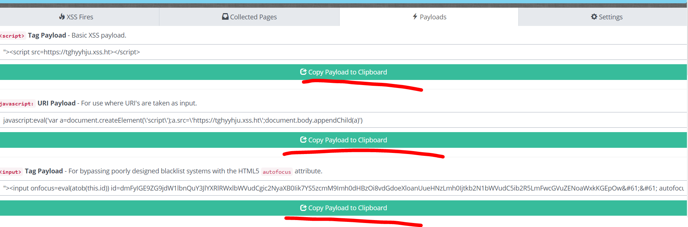

### SQLmap

database 정보를 빼오는데 사용하는 툴이다.

kali linux 켜고 다음과 같이 입력. 쿠키는 해당 url에서 개발자도구로 들어가 확인

옵션1

옵션2

--dump를 사용하여 users 테이블의 모든 내용을 조회함

여기에 모든 로그가 기록되어 취약점 분석 후 꼭 삭제해주어야한다. 개인의 민감한 정보가 들어있기 때문이다.(users 테이블 이니까). 두번째 이유는 새로운 로그가 반영이 안 되기 때문에 지워줘야한다. ip주소 들어간 디렉토리 자체를 지워주자.

-v 옵션은 로그 중에 PAYLOAD가 찍히는 것을 볼 수 있다. 패턴까찌 확인하는 기능이다.

---

### 이번에 할거

low는 주소창에 admin=0을 admin=1로 바꾸면 뚫린다.

medium 뚫는법

1로 바꾸면 뚫린다. 버프스윗으로도 뚫을 수 있지만, 값만 전달하는 것이기 떄문에 영구적으로 바뀌지 않는다. 개발자 모드에서 영구적으로 바뀌게 가능

log in 뚫기, low는 그냥 소스코드 확인하면 들어있고 미디움도 똑같지만, js파일 실행시켜야 한다.

방법1. 개발자도구에서 실행시키고 alert 띄운다

방법2. js 파일 만들어서 돌린다.

---

https://xsshunter.com/app이거 하나도 안들음 모름

대충 해본결과 위에 회원가입하고, 페이로드에서 아무거나 복사해서 글 생성하면

내 글 본사람의 정보 탈취할 수 있다.

### 쿠키 재사용공격(cookie hijacking)

이것도 안들음. 나중에 찾아보자

1) 쿠키 재사용 공격

- 대응방안 -> XSS 취약점 방어(입력 값 검증)

  ​				-> 쿠키 생성할 때 IP 정보 포함 -> 암호화 -> MAC 정보, 하드웨어 정보..

  ​									

---

http://testphp.vulnweb.com/ 뚫기

https://m.blog.naver.com/PostView.nhn?blogId=yong1344&logNo=220657435929&proxyReferer=http:%2F%2F203.233.19.54%2F 여기 참고