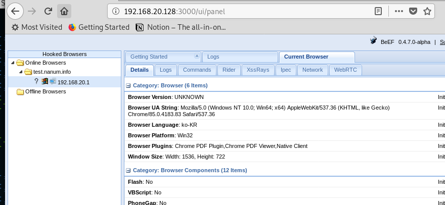
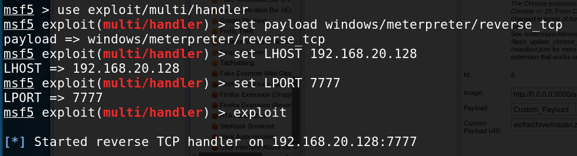
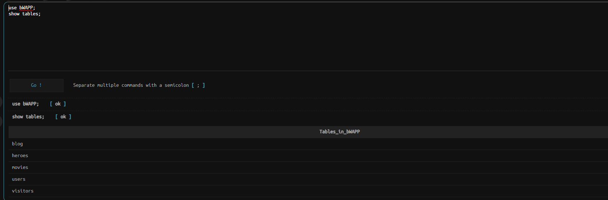

xss 취약점

1. 다른 사용자의 쿠키 정보 획득 -> 관리자 권한
2.  악성코드 배포(js파일로 접속) -> exe 파일 이후에 설치
3. 피싱사이트 유도

beef 실행

아래 주소 파폭으로 접속, 아이디 비번은 beef

로컬에서 윗주소 http://192.168.20.128:3000/hook.js 접속

다음과 같이 http://test.nanum.info:82/board_edit.asp에 글 작성

작성글에 접속하고 kali 확인하면

다음과 같이 test라고 공격하면

공격당함 ㄷㄷ, 하지만 이 공격은 실무에서 사용하기에는 어렵다. 공격하는동안 페이지에 머물러야하기 때문이다.

페이지 바꿔서 악성코드 있는 페이지로 유도 가능

페이지 이동시킴

구글 피싱

ddd

피싱성공

페이크 플래시, 아무튼 뭐 이런게 있음 공격하면 파일 다운받게 함

---

새탭에서 작업

둘이 떨어질 수 없음

kali, payload - 연결점, 공격코드 등으로 불림

 

### msavenom

msfpayload + msfencoder 인놈

새탭에서 작업

생성된

시나리오

1. msfvenom을 이용해서 7777포트로 악성코드 생성
2. 7777포트를 기다리는 핸들러 생성 및 대기상태
3. 생성한 security.exe 파일을 외부에 공개(웹서비스 이용)
4. beef 배포 url에 3번의 공개 url로 수정
5. 플래쉬 업데이트 피싱 사이트 실행

현재 대기중인 상태

securyty.exe 존재하는 디렉토리에서 서버실행

다시 플래시 공격 하면 exe 악성코드 배포되게함, 근데 windows defender가 막네

해제하고 실행하면 다음과 같이 뜨고, PC를 장악한것이다.

shell 입력하면 cmd 접속 됨

keyscan start

이제 입력값을 가져올 수 있다, tghy / tghyhju 입력함

keyscan_dump를 통해 그동안 입력한 값들을 가져올 수 있다.

---

## 파일업로드 취약점

1. 
2. 업로드한 웹쉘의 위치 절대경로를 알아야함
3. 업로드 된 웹쉘 스크립트 실행

우회

1. 자바스크립트 우회

   -> 응답값에 제한 스크립트를 삭제

   -> 허용되는 확장자(jpg)로 올리는 과정에서 확장자를 바꿔서 업로드

   

-> 이후 공격(위에서 한대로)

0. 스크립트 삽입
1. msfvenom을 이용해서 7777포트로 악성코드 생성
2. 7777포트를 기다리는 핸들러 생성 및 대기상태
3. 생성한 security.exe 파일을 외부에 공개(웹서비스 이용)
4. beef 배포 url에 3번의 공개 url로 수정
5. 플래쉬 업데이트 피싱 사이트 실행

들어가서 비밀번호는 b374k

비밀번호는 bug

---

## asp 파일 올리기

간단하다 버프스윗 이용하여 이것만 없애주면 된다.

 

그럼 js 건들지 않고 어떻게 할까? 확장자를 변경하고 올린 후

이 부분을 asp로 바꿔준다. 중간에 바꿔버리는 것이다.

php 파일이 서버사이드에서 막히면, 어떻게 할까? 나중에 물어보자

