침투할 파일 확장자

asp, asa, cds, cer, asx 등등

ASP, ASP.NET, MS-SQL - 윈도, IIS서버

PHP, MySQL - Apache 서버

JSP, Oracle - Apache 서버

리눅스는 대소문자 구분함 -> .php, .PhP, .Php 등

---

결과적으로 파일을 올려서 해킹 가능하게 함

1. cmd.exe 파일에 everyone 권한부여

2. cmd.exe 파일 업로드 하고 설치 절대경로를 확인

3. cmd.asa에서 올린 cmd.exe 파일의 경로로 수정

   C:\web\web\gmshop\upload\bbs\cmd_5252.exe

4. cmd.asa 파일을 올려서 명령어 실행여부 확인

1. everyone 권한부여한다.

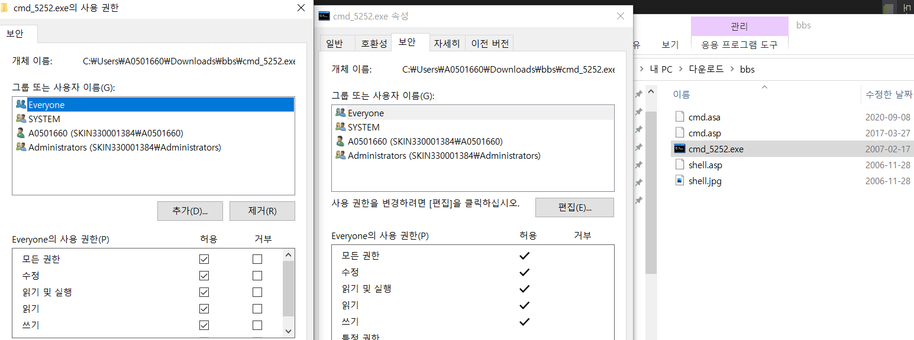

2. cmd.exe 파일 업로드 하고 설치 절대경로를 확인

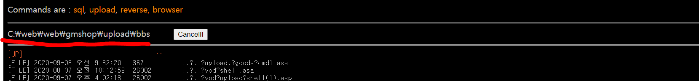

3. cmd.asa에서 올린 cmd.exe 파일의 경로로 수정

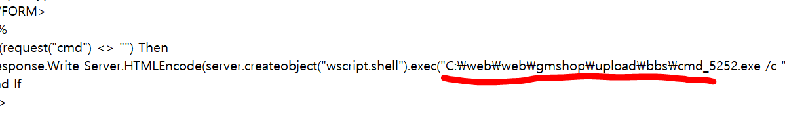

4. cmd.asa 파일을 올려서 명령어 실행여부 확인

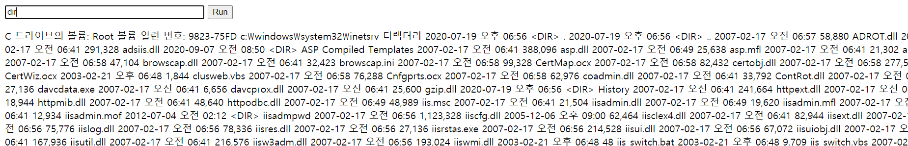

파일 업로드 취약점의 조건

1. 자바스크립트 우회 -> 서버사이드 스크립트 처리

2. 확장자 검증 미흡(서버사이드 파일이 업로드, asp, php, jsp...)

   jpg, png, doc, pdf... 만 허용

3. 업로드한 웹쉘의 위치 절대경로를 알아야함

4. 업로드된 웹쉘이 스크립트 실행(shell.php.tmp...)

5. 웹서버하고 업로드 되는 서버 분리하면 파일 취약점 보완 가능

   사용자 -->업로드-->     [웹서버] ==> [이미지서버(스크립트 실행X)]

   하지만 웹서버랑 업로드 서버 분리하면 비용이 2배로 들어가서 잘 안 함

 

다운 받을 때 퍼미션 디나이 되면 sudo로 

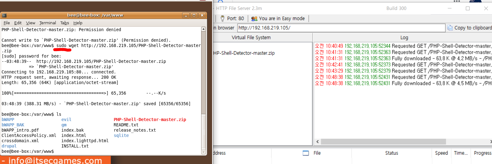

---

오후, 바로바로 공격할 수 있는 웹쉘

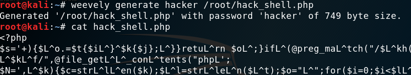

여기에

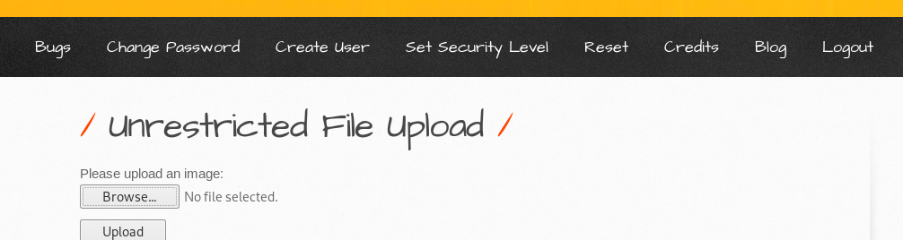

방금 만든거 올리면

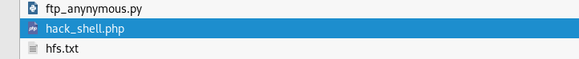

이제 침투 가능

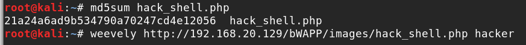

---

기타 공격들

### OS Command Injection(안들었음)

### RFI/LFI

http://test.nanum.info:83/demoshop/shop_board/shop_board_list.asp?page=1&v_num=4748에 접속

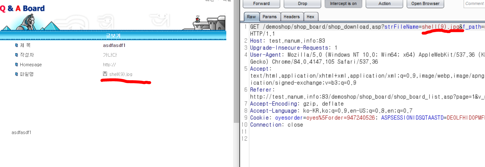

리피터로 보냄

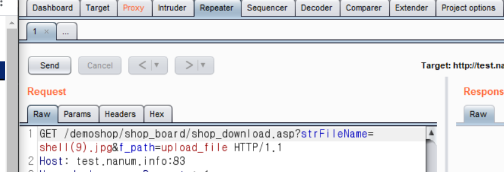

---

## Win7

윈도7 실행하고 아이디 패스워드 기억

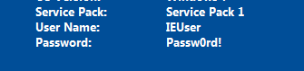

윈도7 exploit-db접속하고 hfs 검색하고 다음에 들어가서 다운로드 받음

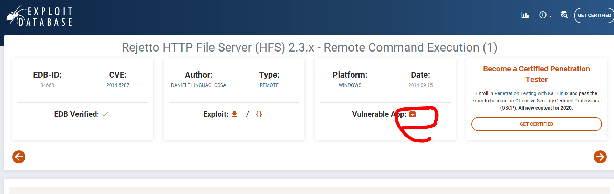

윈도7 웹에서 아이피로 접속하면

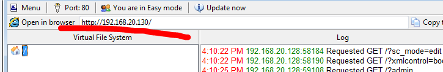

다음이 뜸

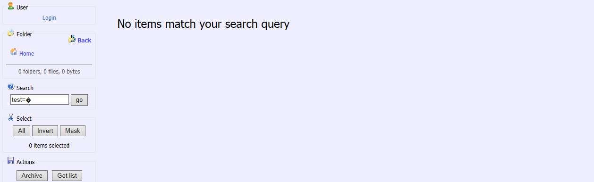

exploit-db에서 조금 내려가면 다음이 있고 이걸 위 검색창에 입력하면 도스창 4개가 뜸

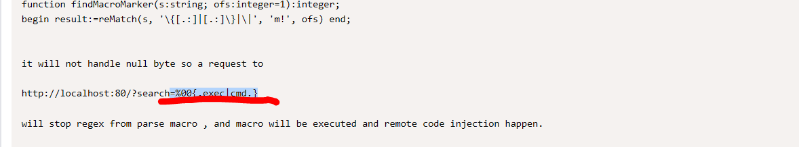

칼리에서 메타스플릿 실행

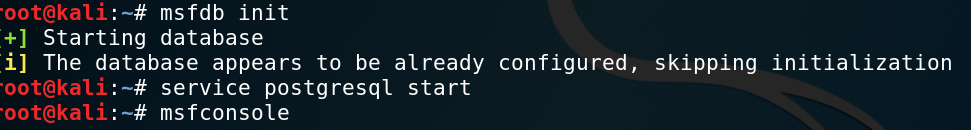

여기에 show options 입력하면 옵션 볼 수 있음.

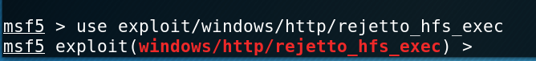

또는 hfs ip입력하면 들어가서 실행된 것 볼 수 있다.

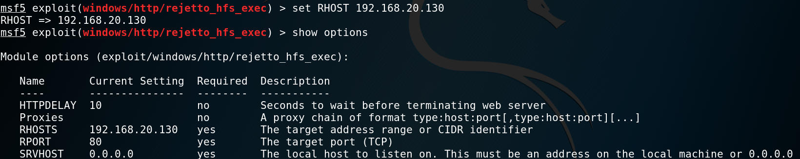

새 탭에서 와이어샤크 실행

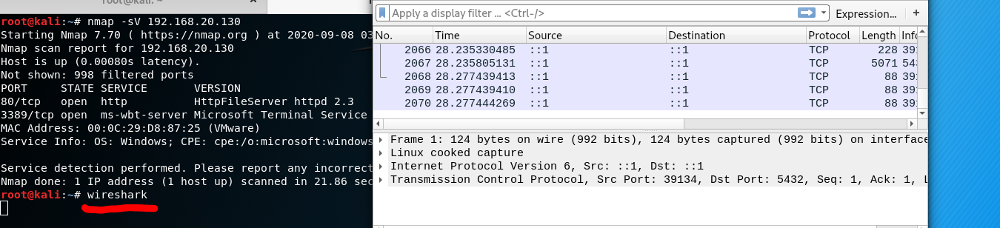

공격하면 와이어샤크 로그 올라감

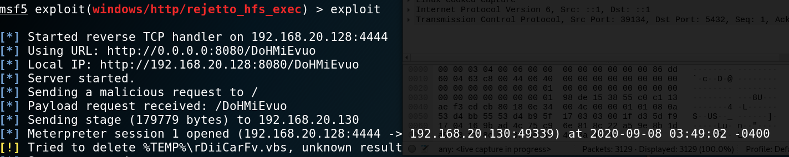

와이어샤크에서 http 검색후 

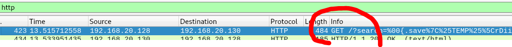

우클릭 follow - tcp stream

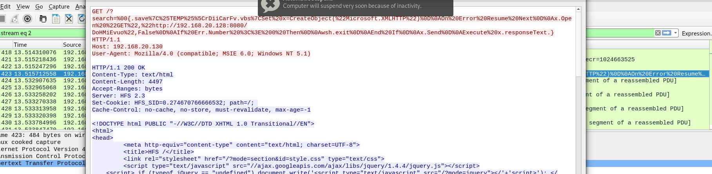