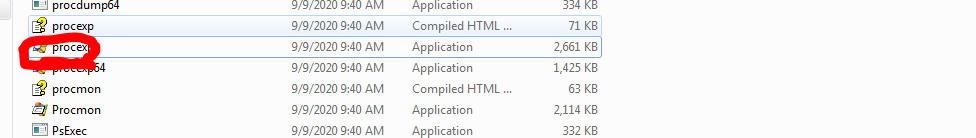

win7에서 아래 다운로드

https://www.dropbox.com/s/x6q5ciek74f2hgc/SysinternalsSuite_old.zip?dl=0

압축풀고 이거 실행

---

시나리오

1. 관리자 계정 획득
2. 웹쉘로 파일 꺼내옴
3. 악성코드 심기
4. 사용자 PC에서 악성코드 받아서 실행시킴
5. 실행 결과를 내부에서 서칭했더니
6. HFS서버가 있었고
7. 그 관리자 AD 침투

AD 구성

방어팀 할일

1. 웹서버 서버 설정(불필요한 서비스, 접근통제)
2. 시큐어 코딩
3. 방화벽 차단 정책