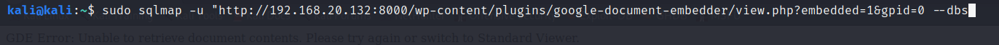
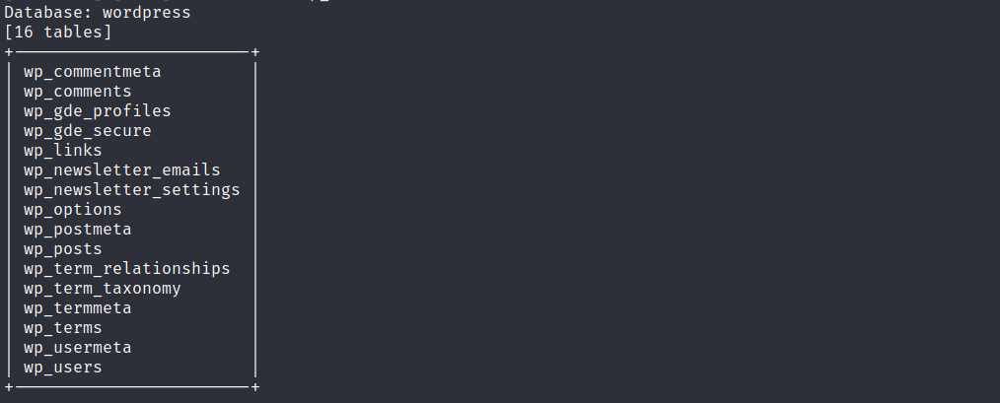

보고서 쓰는법

nvd.nist.gov 이거 왜 들어간거냐


### 도커 뚫기

(선생님은 nessus도 사용했는데 이거 뭘 위해 어떻게 쓴건지 모르겠음 스캔하는 모듈 같음)

이건 도커


kali 2020버전 키고 다음 명령어 입력

```
sudo nmap -sV 192.168.20.132
```


nikto로 확인해보면


또한 위 작업을 통해 워드프레스 4.8인 것을 확인할 수 있다. 취약점을 찾아보자


 워드프레스에서 가능한 브루트포스 공격 복사


브루트포스 공격 시작


wpscan, 설치된 플러그인 같은 정보 알려줌 sudo 붙여야함


버전도 알 수 있고, 뭐 여러가지 알 수 있음 위에서 버전 4.8 못찾았으면 이걸로 찾아주자


열거형(enumerate)으로 유저(u) 정보 알기


다음과 같은 정보 나오는데


들어가보면 이런게 나옴, bob이라는


이제 패스워드를 알아내야 하는데, 브루트포스 때려주자. 먼저 seclists 설치


이제 스캔해주자

```
sudo wpscan --url http://192.168.20.132:8000 --passwords /home/kali/SecLists/Passwords/Common-Credentials/10-million-password-list-top-10000.txt --usernames bob
```


비밀번호를 알아냈다


워드프레스에 접속하였다!, 참고로 이건 docker 아디 비번은 아니다. 이걸 막기 위해서는 ip/wp-login.php에 접근하는 ip를 따로 설정해야하는데, 안 하는 곳이 대부분이다. 우리는 이게 docker를 위해 돌리는지 현재상황에서는 모르기 때문에 일단 접속했다.


플러그인 들어가서 activity로 활성화 하고 wpscan으로 검색하면 플러그인 활성화된거 나와야 하는데 안나옴(원래는 나와야함)


exploit-db에서 다음과 같이 찾을 수 있지만,


우리는 embedder 검색해서 이거 받을거임


받은 뒤 워드프레스에서 플러그인 추가해주자


이거 추가됨


ㅁㄴㅇㄹ

이 플러그인에 대한 취약점은 다운 받은 exploit-db에서 확인 가능


근데 이것도 안되므로 아래 주소로 들어가서 이거 다운 후 플러그인 설치


얘는 이런 문제가 있다


들어가면 정보들이 노출된다.


맨 뒤만 profile로 바꾸면


아까 안된거 sqlmap으로 한 번 돌려보자. sql 공격 알 수 있다.

```
sudo sqlmap -u "http://192.168.20.132:8000/wp-content/plugins/google-document-embedder/view.php?embedded=1&gpid=0" --dbs
```



테이블 확인해보자

```
sudo sqlmap -u "http://192.168.20.132:8000/wp-content/plugins/google-document-embedder/view.php?embedded=1&gpid=0" -D wordpress -tables
```



웹쉘로 공격하기 위해 msfconsole 접속


원리는 워드프레스 플러그인 업로드해서 공격하는 거임


옵션도 확인 가능


접속 및 공격, 근데 실패 뜸(원래 성공해야함)


문제를 찾아보자, 구글링 해보니 php 공백이 들어간 에러였다. 플러그인에서 공백 제거하고 업데이트


화살표 부분이 띄워져 있었음


이제 접속이 잘 된다. 굿


이제 좀 어렵게 수동적인 방법으로 뚫어볼 예정임

스태틱 바이너리스는 리눅스의 도구명령 모음집이라 생각하면 됨


경로 들어가서 nm 선택하고


다운 받으면 된다


다음과 같이 다운하고 권한설정


다음과 같이 파일 업로드 하고 쉘 ㄱㄱ


이제 ./nmap 하면 안되는데 내가 var/www/html에 받아놔서 그렇다.


경로 바꾸고 하니까 잘댐


이제 mysql 접속할 차례다 위 사진 보면 172.18.0.3에 mysql 3306포트가 열려있는 것을 확인할 수 있다.


포트 설정해주고, 아까 mysql 비밀번호를 확인했었다.


이제 들어가면 워드프레스 db에 접속된다! 넌 뒤졌다 이제


---

웹쉘 공격 또다른 방법은 weevely


확인하고 카피해서 사용


이제 플러그인 편집해서 사용


다 지워주고 붙여넣기(파란색 부분도 지워도 댐), 그리고 업데이트


이렇게 나오면 댐


여기서 이렇게 확인하면, 뭐 정보들이 뜨고


이거 확인하면 도커에서 도는거라는 것을 알게 됨


<br/>

이제 좀 어렵게 수동적인 방법으로 뚫어볼 예정임

스태틱 바이너리스는 리눅스의 도구명령 모음집이라 생각하면 됨


경로 들어가서 nm 선택하고


다운 받으면 된다


다음과 같이 다운하고 권한설정


여기부터 안돼서 메타스플릿(위)에 가서 파일 업로드 한다. 위블리는 이제 안씀 

<br/>

아무튼 여기서 하고 싶은 얘기는 아이디랑 패스워드도 브루트포스로 뚫기 가능하다는 것

간단요약

1. 워드프레스 사용여부 확인, 버전확인
2. 워드프레스 취약한 플러그인, 테마확인
3. 사용자 정보 획득
4. 관리자 페이지 접근
5. 플러그인 설치된 페이지 조작해서 웹쉘 업로드(선택)
6. 취약한 플러그인을 설치해서 침투(선택)


아무튼 직접 접근 가능한 플러그인 찾아서 설치해주자

