## EQST 1번

### ASP

아래와 같이 입력하고 아무 비밀번호 입력하면 정답 나옴

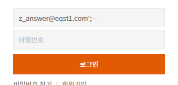

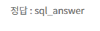

### JSP

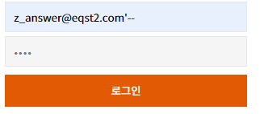

### PHP

주석만 #으로 바꿔주면 된다

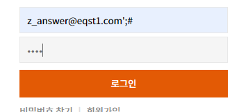

---

## 3번(주석 필터링)

### ASP, JSP, PHP

아이디 뒤에 틀린 것을 넣어준다

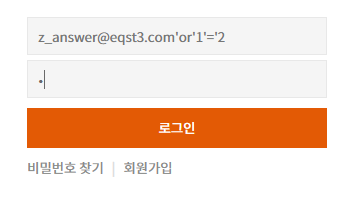

### JSP, PHP

아이디 뒤에 맞는 것을 넣어줘도 된다.

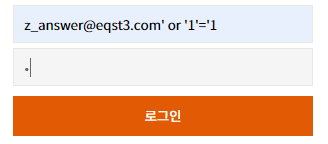

---

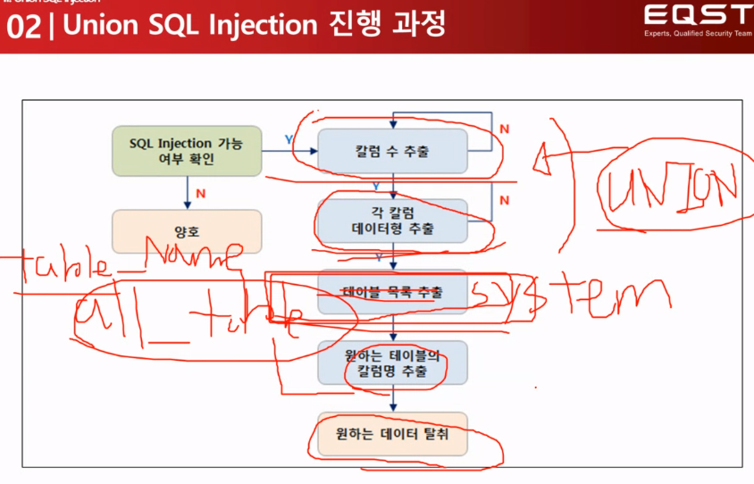

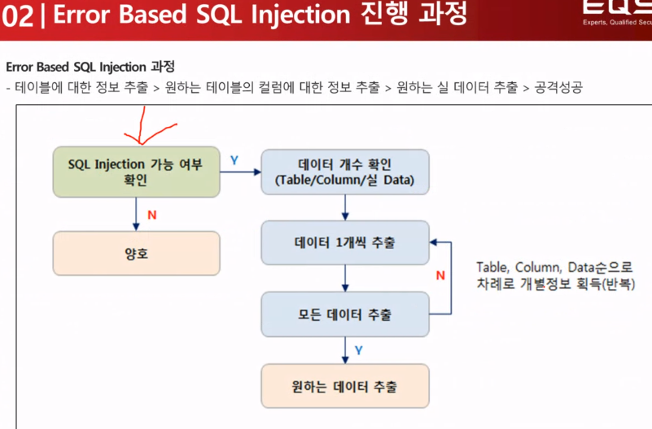

인젝션 대책

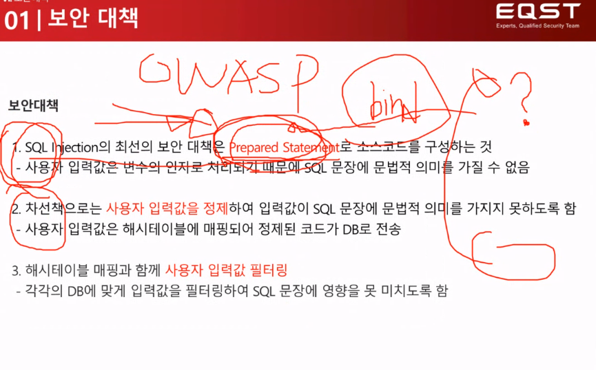

---

## 4번 테이블 이름 찾기

파라미터마다 싱클쿼테이션을 넣어본다. 맨 뒤에 넣었을 때 500에러 난다

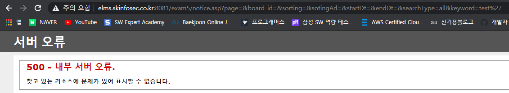

다음과 같이 첫번째 글자 아스키코드값 몇인지 찾는다.

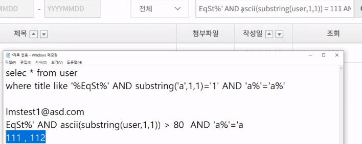

 첫번째 답은 osec