XSS 1, 2번 답

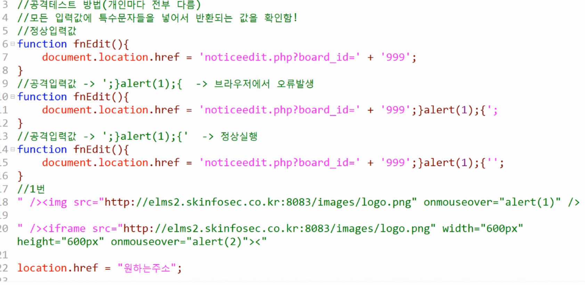

3번 답

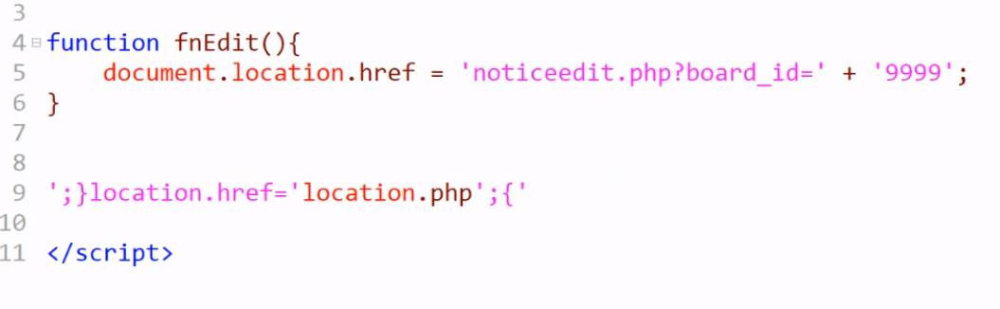

---

## CSRF

1번

1. 일반 사용자로 로그인 후 csrf 공격코드 있는 게시물 작성
2. 권한 변경 시도해봄
3. 관리자로 로그인 후 게시물 열람
4. 다시 일반 사용자로 로그인하면 권한상승되어있음

권한 변경 시도

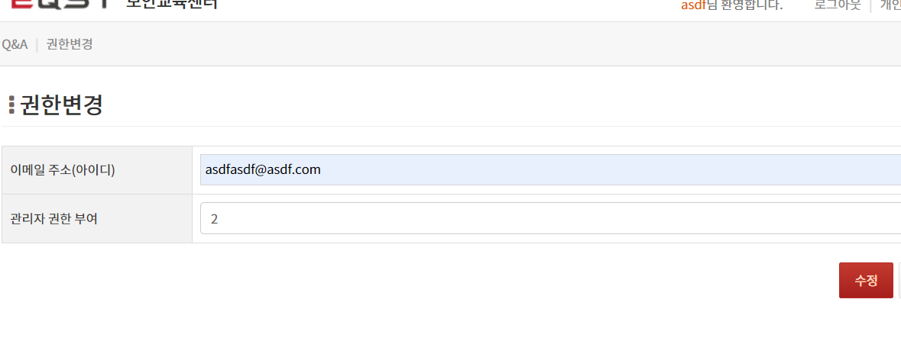

변경 불가능 뜸

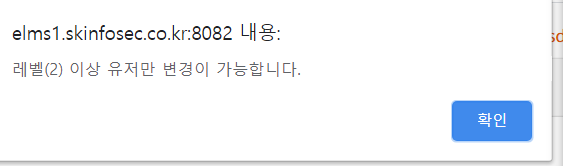

다음과 같이 버프스윗으로 권한변경하는 코드 확인 가능

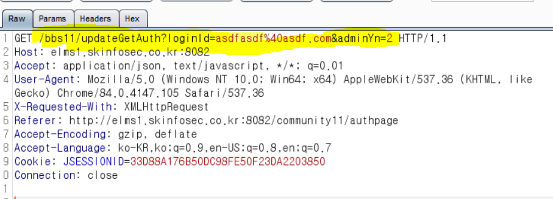

버프스윗을 통해 게시글 작성시 다음과 같이 이미지 공격코드 삽입

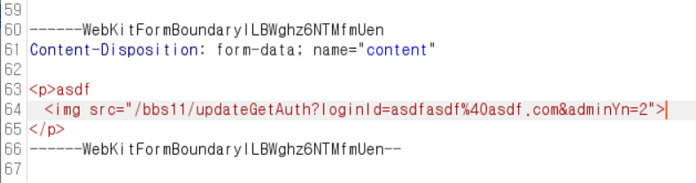

관리자로 로그인하고 게시글 열람

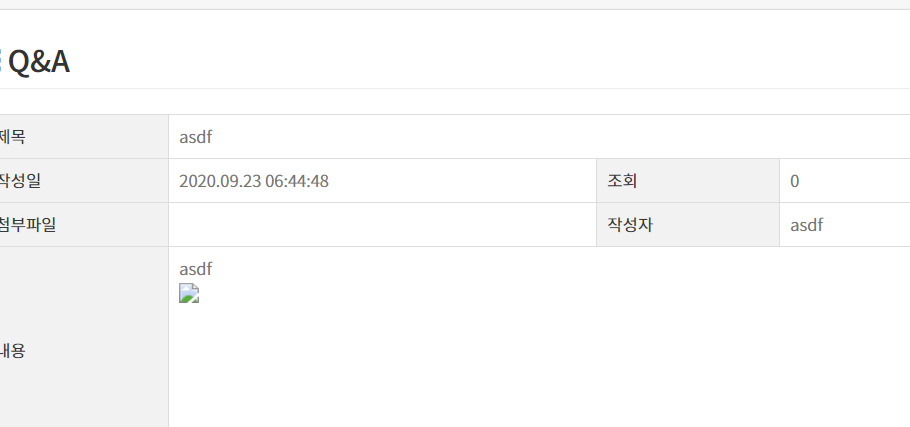

다시 일반사용자로 로그인하면 권한 상승되어 있음

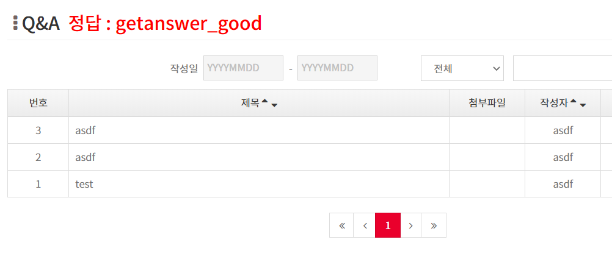

---

## SSRF

CSRF는 클라이언드 사이드이고, SSRF는 서버 사이드이다.

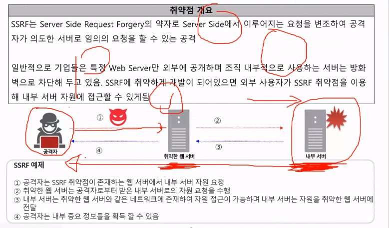

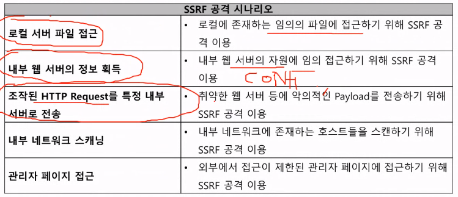

1번문제

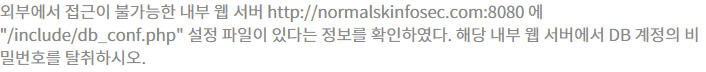

로그인 후 공지사항 업데이트 부분에서 프록시 켜야함. 그리고 file 부분에 문제에서 제시한 주소 넣으면

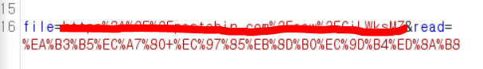

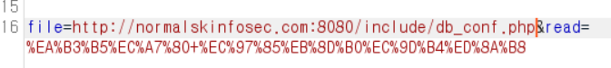

다음과 같이 db정보 탈취가 가능하다

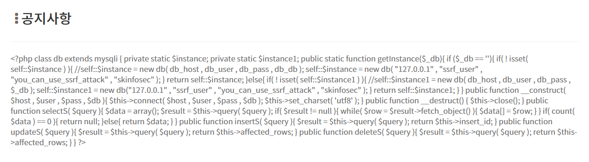

2번

사진 확인하기를 누르면 서버에서 이미지를 가져와서 base64로 인코딩한 후 보여줌. 이를 이용해서 SSRF 공격한다

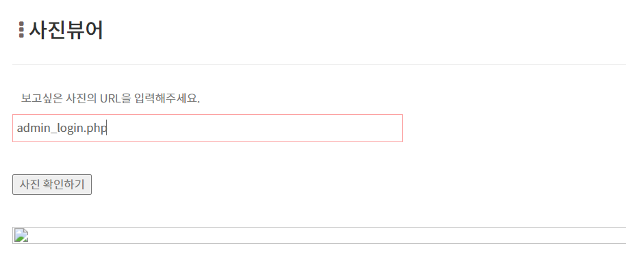

admin_login.php 를 프록시에서 보면 다음과 같이 나온다

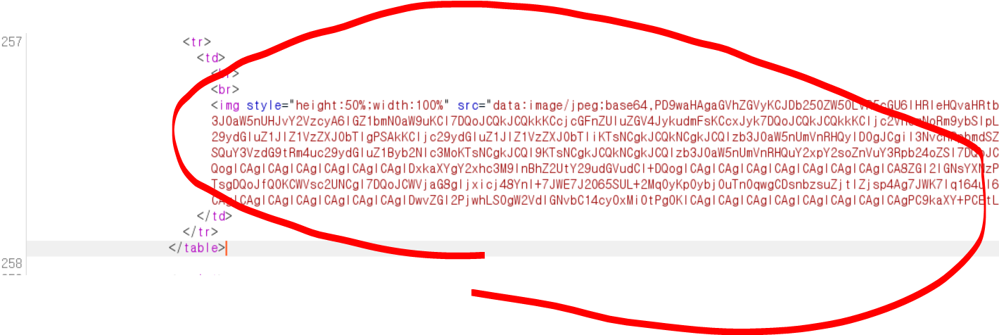

이 코드는 현재 base64로 인코딩 되어있기 때문에 decoder로 가서 디코딩해준다

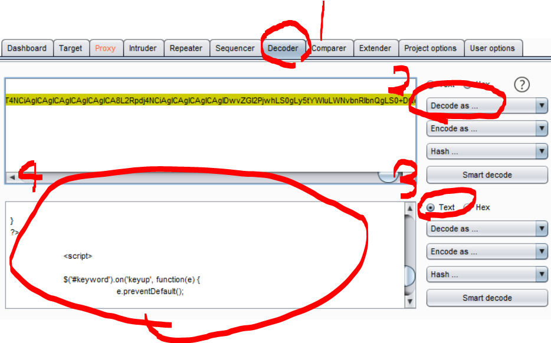

vscode에서 확인해보면 admin의 아이디와 비밀번호를 알 수 있다.

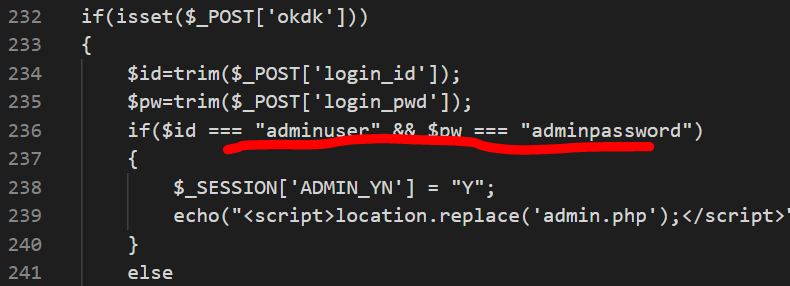

이제 db정보를 찾아야 한다. 맨 위에서 아래와 같은 php 파일을 찾을 수 있다. 사실 php 파일 모두 열어봐야한다.

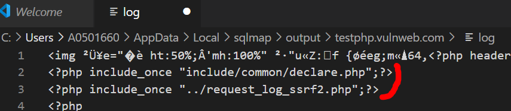

include/common/declare.php를 확인해보면, 아래 파일들을 확인할 수 있고

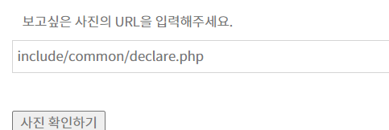

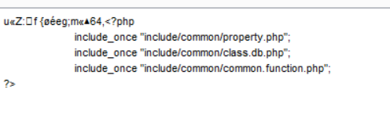

그럼 다시 class.php를 털면

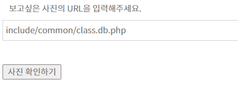

db정보를 확인할 수 있다.

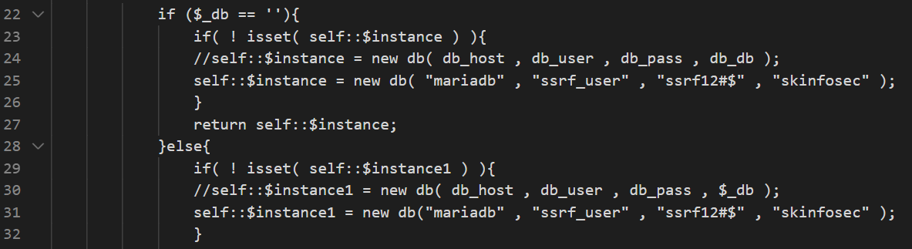