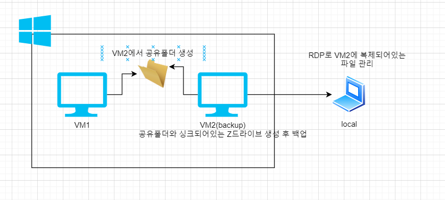

1. C 데이터가 유휴 상태에서 암호화되도록 하는 것은 고객의 책임이다
2. A
   - Cost Allocation tags : 비용 할당 태그를 이용하면 AWS 비용을 더 자세히 추적할 수 있다
   - Consolidated billing : 통합결제는 여러 계정의 결제 통합 가능
   - AWS budget : 예산을 지정하고 초과시 알림 받음
   - AWS Marketplace : OS, network, 보안 등 자신만의 솔루션을 사고 파는곳
3. C
   - Amazon Glacier(빙하) :데이터를 수년 혹은 수십년까지 효율적으로 저장
   - AWS Storage Gateway : 온프레미스 IT 환경과 AWS 스토리지 인프라 사이에 원활한 통합이 이루어지도록 지원
   - S3 : 객체를 저장하고 해당 객체에 실시간으로 액세스하며 버전 관리 및 수명주기 기능을 제공
   - EBS : EC2에서 사용하도록 설계된 사용하기 쉬운 고성능 블록 스토리지, EC2의 데이터를 장기적으로 유지하거나 암호화 하는 경우는 EBS를 사용. 인스턴스 종료시에도 데이터를 보존해주고 스냅샷, 인스턴스 재연결, 전체 볼륨 암호화를 지원함.
4. d
   - 

