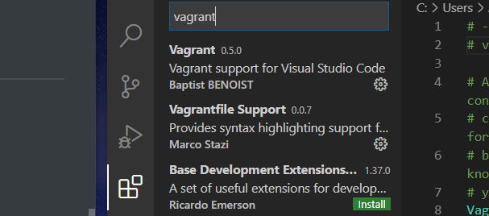
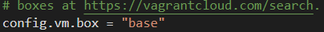
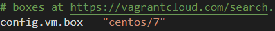

## 200706 클라우드 2장


IDE(integreted Development Env) : 통합개발환경, vsStudio, eclipse etc..

형상관리 툴(VCS): 대표적으로 git


테스트서버(production server) : 로컬에서 개발한 코드를 테스트해봐야한다, 서버가 필요함

VPN(virtual private network) : 가상 사설 네트워크

프록시(proxy) : 인바운드, 아웃바운드 제어해서 외부,내부에서 접근 가능을 제어한다.

아웃바운드 제어 : 도박사이트 등 접속 못하게 막는 것, 나가는 통신 제어

인바운드 제어 : 들어오는 통신 제어


Authentication: 인증 

Authorization: 권한

---

## vagrant, virtualBox

다음 2개를 설치해준다

1. vagrant (https://www.vagrantup.com/) : 가상머신에서 관리 쉽게 해줌
2. virtual box (https://www.virtualbox.org/wiki/Download_Old_Builds) : 가상머신

cmd에서

```shell
$ mkdir vagrant
$ vagrant plugin install vagrant-vbguest # 모듈 하나 설치해주고
$ vagrant init # 초기화해준다, Vagrnatdile 생성
$ code Vagrantfile # vscode로 열기
```


extensions에서 두개의 모듈 설치해준다




사용할 버전을 입력해준다. 






다시 터미널로 와서 기동시켜준다

```shell
$ vagrant up
```

---

그렇다면 vagrant는 무엇인가?

가상화 인스턴스를 관리해주는 sw이다.

```shell
$ vagrant init # provisioning 하는 스크립트 생성
$ vagrnat up # provisioning 진행
$ vagrant halt # host 종료
$ vagrant destroy # host 삭제
$ vagrant ssh # 접속
```

---

일단 up해서 설치가 되면,

```shell
$ vagrant status # 가상머신 돌아가는거 확인
$ vagrant ssh #접속
```


삭제하고 Vagrantfile을 다음 스크립트로 바꿔준 후 다시 up 해서 3개 돌려준다

https://github.com/joneconsulting/cloudcomputing/blob/master/Vagrantfile


nginx, nodejs, tomcat 각각 설치해보자

nginx : Nginx는 웹서버. 간단하게 웹서버는 클라이언트로 부터 요청이 발생했을 때 요청에 맞는 정적파일을 보내 주는 역할. Nginx는 규모가 작은 서비스이면서 정적 데이터 처리가 많은 서비스에 적합

## nginx

## /etc/yum.repos.d/nginx.repo 파일 생성

```
sudo vi /etc/yum.repos.d/nginx.repo
[nginx] 
name=nginx repo
baseurl=http://nginx.org/packages/centos/7/$basearch/
gpgcheck=0
enabled=1
```

## nginx 설치

```
sudo yum install -y nginx
```

## 방화벽 실행, 포트 추가

```
sudo systemctl enable firewalld
sudo systemctl start firewalld
sudo firewall-cmd --permanent --zone=public --add-port=8080/tcp
sudo firewall-cmd --reload
sudo firewall-cmd --list-ports
```

## PORT 변경

```
sudo vi /etc/nginx/conf.d/default.conf (포트 변경)
sudo systemctl start nginx
sudo systemctl enable nginx
```


## nodejs 설치

```
sudo yum install -y epel-release
sudo yum install -y nodejs
```

## 작업 디렉토리 생성

```
mkdir work
cd work
```

## nodejs 프로젝트 생성

```
npm init
npm install express --save
```

## 시작 파일 변경

```
vi package.json
VI editor 사용법:
Command 모드 <-> Insert 모드
Command 모드 -> Insert 모드 : a, i, o 키를 이용
Insert 모드 -> Command 모드 : ESC 키 이용
저장 : Command 모드에서 :wq! 입력 
```

## app.js 파일 생성

```
vi app.js
```

## 서버 실행

```
npm start 
```

---

# MSA

polyglot : 하나의 어플리케이션을 만들 때 여러가지 언어의 각각의 장점을 살려서 만드는 프로그래밍 기법. MSA가 적용되어있다.